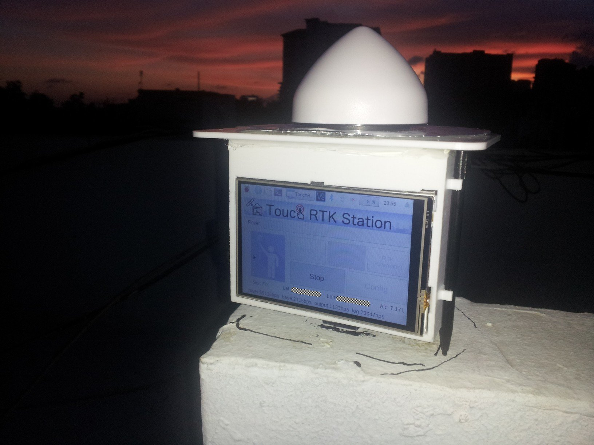

# RTK para todos. Unidad GNSS de bajo costo basado en Raspberry Pi: primeros resultados y potenciales aplicaciones

*XVIII Jornada de Investigación Científica*

*12, 13 y 14 de noviembre, 2019*

**Sometimiento de resumen**

| | |
|:--|:-----------|
| **Título:** | RTK para todos. Unidad GNSS de bajo costo basado en Raspberry Pi: primeros resultados y potenciales aplicaciones |
| **Tipo de participación:** | Oral |
| **Nombre de autores:** | José Ramón Martínez Batlle |
| **Institución/Facultad:** | Facultad de Ciencias |
| **Resumen:** | La técnica de posicionamiento global preciso conocida como navegación cinética satelital (RTK-GNSS), dadas sus altas exigencias de hardware y software, estuvo durante años reservada a un reducido mercado profesional y corporativo. Los fabricantes vendían costosos equipos con programas de código cerrado y bajo estrictas licencias privativas. Con la publicación de la biblioteca RTKLIB (primera versión en 2007), por Tomoji Takasu, escrita principalmente en C, Pascal y C++, y sus posteriores mejoras basadas en pruebas exhaustivas, se superó la limitación de software. Igualmente, la mejora en rendimiento de procesadores cada vez más pequeños, permitió llevar aplicaciones complejas a computadoras portátiles y de placa reducida. Adicionalmente, la irrupción en el mercado de receptores GNSS de bajo coste, impulsados sobre todo por la industria automotriz, ha abaratado significativamente la navegación RTK. En este estudio se presentan los resultados de soluciones fijas generadas en tiempo real y por posproceso a partir de datos brutos colectados durante varios días en intervalos de 30 minutos, entre los meses de agosto y octubre de 2019, utilizando como referencia la CORS de Santo Domingo. El equipo de colecta consistió en una unidad base en modo estático, compuesta por una Raspberry Pi, un receptor GNSS ublox y dos antenas multi-constelación usadas de forma consecutiva. Los resultados muestran consistencia y precisión respecto de la estación de referencia, con error máximo del orden del centímetro. Se consideran potenciales aplicaciones para monitoreo de la deformación y subsidencia del terreno, así como para el estudio de fenómenos naturales como deslizamientos e inundaciones.|
| **Palabras clave:** | real-time kinematics, GNSS, DInSAR, geodesia |

