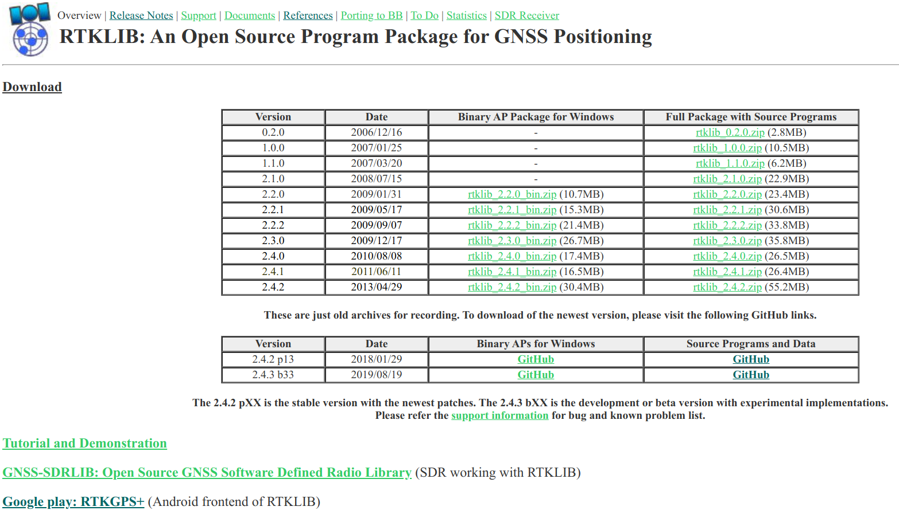

```{r setup, include=FALSE}
knitr::opts_chunk$set(echo = FALSE)
```

# PREÁMBULO

## Autopresentación

- Incluye nombre, carrera que estudias o profesión, municipio de residencia, expectativas y cualquier otro detalle que quieras agregar.

## Programa del curso

- [Motivación: precisión para aplicaciones usando software libre y proyecto DIY (esta presentación)](https://geofis.github.io/rtk-para-todos/curso-dic21-00.html)

- [Práctica 1. Familiarización con los recursos informáticos](https://geofis.github.io/rtk-para-todos/curso-dic21-p1.html)

- [Teoría 1. GNSS: vistazo general, conceptos, sistemas/plataformas satelitales](https://geofis.github.io/rtk-para-todos/curso-dic21-t1.html)

- [Práctica 2. Trilateración. PPK con datos existentes](https://geofis.github.io/rtk-para-todos/curso-dic21-p2.html)

- [Teoría 2. GNSS: fuentes de error, resolución de errores](https://geofis.github.io/rtk-para-todos/curso-dic21-t2.html)

- [Práctica 3. Colecta de datos de campo, RTK y PPK](https://geofis.github.io/rtk-para-todos/curso-dic21-p3.html)

## Rescatando la lista de los reyes magos del primer día

- Visitar una parcela preferiblemente ya medida previamente por otro método/persona. Hacer mensura, comparar.

- Colectar datos en terreno campo.

- Tomar datos crudos o hacer solución fija en el vértice de la Plaza de la Bandera.

## Rescatando la lista de los reyes magos del primer día

- Hacer flujo de trabajo PPK completo con RTKLIB.

- Montar un receptor DIY / como configurarlo.

- Hacer PPP.

- ¿Qué se puede rescatar de aquí? Debemos decidir.

## Recomendaciones

- Tumba el miedo a la consola de comandos.

- Esta expresión no te va a ayudar: "da error". Comienza a practicar desde ya, y cámbiala por: "Obtuve un error que me parece tiene que ver con <inserta aquí tu sospecha>, el cual dice lo siguiente: <inserta aquí tu mensaje de error favorito>. Intenté resolverlo por mi cuenta mediante <inserta aquí las soluciones que implementaste>, pero no tuve éxito".

- Bájale todo lo que puedas a las expectativas. La única fortaleza de este curso no es su contenido, sino la libertad. Te adelanto que el contenido será mínimo, pero al menos conocerás soluciones libres para aprender el enorme volumen de temas restantes.

# ¿QUÉ ES RTK? ¿POR QUÉ UN PROYECTO DIY? ¿POR QUÉ SOFTWARE LIBRE?

## ¿Qué es RTK? Vistazo general

* Siglas de *real-time kinematic*, es una técnica de __navegación satelital global__, que utiliza la __fase de la onda portadora__ (a diferencia de la técnica convencional, basada en códigos pseudoaleatorios de baja frecuencia) enviada por satélites de posicionamiento, tales como GPS, GLONASS, Galileo y BeiDou, para calcular, con __precisión centimétrica__, la distancia entre una estación base de coordenadas conocidas y una estación exploradora o *rover*.

## {width=90%}

Según @novatel2015introduction

## Comparación entre técnica estándar y basada en onda portadora

|     |     |     |
|:---:|:---:|:---:|
|     | Basada en códigos pseudoaleatorios (estándar) | Posicionamiento preciso (basada en onda portadora) |
| Observaciones | Pseudorango (de códigos)| Onda portadora + pseudorango |
| Precio de receptor | Baratos, ~US\$100 | __Muy caros ~US\$10,000-40,000__ |
| Exactitud | 3 m (H), 5 m (V) | __5 mm (H) 1 cm (V) (modo estático)__ |
| Aplicaciones | Navegación marítima, búsqueda y rescate | Topografía, mensura, cartografía de alta precisión |
<small>Los costos son para equipos funcionales listos para usarse, "apenas sacados de su empaque"</small>

## Limitaciones globales

- Alto __costo de equipos__ listos para usar.

- Predominio de __soluciones__ de software privativas.

- Red de CORS pública de __poca densidad__.

- __Redes privadas__ existentes y densas, aunque de __costos__ elevados.

## Proyecto DIY ("hazlo tu mismo")

- Se trata de un proyecto autofinanciado, que constituye un __soporte esencial__ para otras múltiple investigaciones en marcha.

- Por lo tanto, su importancia radica en la capacidad de soportar __múltiples aplicaciones en geografía y mensura (entre otras áreas) a bajísimo costo y con soluciones libres, SIN SOFTWARE PRIVATIVO NI HARDWARE COSTOSO.__

## Fabricantes de receptores GNSS con capacidad RTK

- Trimble, Leica, Topcon, NovAtel, JAVAD, ...

- u-blox, Septentrio, Skytraq, ComNav Technology ...

## {width=85%}

## 

## Soluciones de software libre / código abierto

- La mayor parte de los equipos anteriores usan software privativo creado por el fabricante. Por lo tanto, con dicho software no es posible:

  - Estudiar ni mejorar las soluciones.
  - Compartir el código con colegas.

- En cambio, con software libre/código abierto, sí es posible.

{width=60%}

## Aplicaciones

* Monitoreo de __deslizamientos, fallas__.

* Mensura.

* Fotogrametría con __UAV__.

* Construcción, monitoreo de __edificaciones y estructuras__ (puentes)

* __Agricultura__ de precisión.

* Detección de __tsunamis__ por boyas GNSS.

* Sistemas de __transporte__, vehículos autónomos.

* Sistemas de cartografía __móviles__ (Street View).

* ...

## ¿Cuándo comencé?

- En __2018__ construí una solución monobanda.

- Dicha solución, aunque útil para determinadas aplicaciones, fallaba en determinados ambientes para __converger eficientemente__ (AR).


## ¿Cuándo comencé?

- Desde entonces me concentré en:

    - Construir una __solución integral__, que incluyera __base y rover ambos de doble frecuencia__.
    
    - Crear __scripts de operación básicos__, así como mejorar/adaptar software de terceros, basándome sobre todo en RTKLIB.

# MATERIALES Y MÉTODOS

## Hardware

## 

## 

## 

## 

## 

## <span style="font-size:60%;">Partes adquiridas para equipo de colecta (Financiamiento: "SALARIO-CyT")</span>

| Parte                                                                         | Costo aprox.|
|-------------------------------------------------------------------------------|------------:|
| Base o rover, los imprescindibles: receptor, RPi, antena.                     |    US$340   |
| Adaptador de corriente, palo, trípode, conectores, cables, carcasa, batería   |    US$240   |

<span style="font-size:60%; float:left;">- No se incluyen fletes.</span>

<span style="font-size:60%; float:left;">- Para una base fija tipo CORS, se deben añadir los costes del __soporte de hierro__ (~US$40) y __el cable__ (el valor dependerá del calibre elegido y la longitud del mismo). Otros complementos deseables son un __tribrach__ (base nivelante), __protección contra rayos__ y una estación meteorológica.</span>

## ¿Qué es una Raspberry Pi?

{width=35%}
{width=35%}

## Software

## RTKLIB

* Biblioteca [RTKLIB](http://www.rtklib.com/) (primera versión, 2007), por Tomoji Takasu [@takasu2011rtklib; @takasu2009development]



## RTKLIB


## RTKLIB


## BashRTKStation

* Colección de scripts [BashRTKStation](https://github.com/geofis/BashRTKStation/)

{width=50%}


- https://github.com/geofis/BashRTKStation/

## RTKBase

* Fork propio de RTKBase para usarlo:
    * __En la base__.
    * También __en el rover__, pues tiene capacidad de envíar correcciones RTCM3 a receptor.

## {width=75%}

- https://github.com/geofis/rtkbase

## 

## Centipede


- https://centipede.fr/

## RTKMisc

{width=80%}

- https://github.com/geofis/RTKMisc

# RESULTADOS

## Solución PPP para la base (NRCAN)


## Solución PPP para la base (NRCAN)


## Comparación soluciones NRCAN y AUSPOS


## Campus UASD

## 

## 

## {width=70%}

## 

## {width=80%}

## Playa Najayo


## Playa Najayo


## Obras


## Mensura


## Hundimiento en César Nicolás Penson


## rtk2go. Servicio público

{width=55%}

<small>- URL: rtk2go:2101, Mountpoint: geofis_ovni</small>
<small>- Status: [http://rtk2go.com:2101/SNIP::MOUNTPT?NAME=geofis_ovni](http://rtk2go.com:2101/SNIP::MOUNTPT?NAME=geofis_ovni)</small>

# DISCUSIÓN Y PERSPECTIVAS

## Discusión

- Los resultados obtenidos __son precisos__, con errores estándar bastante bajos, de orden centimétrico incluso milimétrico.

- Las aplicaciones profesionales y su uso en producción __son de sobra viables__.

- Su __uso en la enseñanza__ es una de las aplicaciones idóneas.

- Las aplicaciones para __monitoreo de movimiento de la estructura__ (por ejemplo,  por subsidencia), al menos para desplazamientos de desarrollo lento y de __orden centimétrico__, son perfectamente viables.

## Perspectivas. ¿Qué estoy haciendo actualmente con este equipo?

* Dando __capacitaciones__ básicas. __Apoyo personas abiertas a Linux, software libre y consola de comandos__.

* Monitoreando de __deslizamientos__.

* Caracterizando __granulometría de carga gruesa__ superficial de lechos de río/llanura de inundación mediante UAV.

* Monitoreando __deformación en SD__, con énfasis en la UASD.

# REFERENCIAS

<section style="font-size: 24px; text-align: left;">