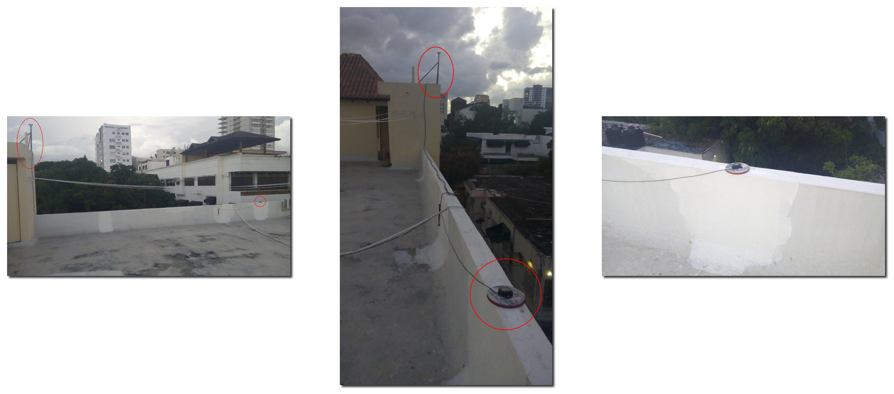
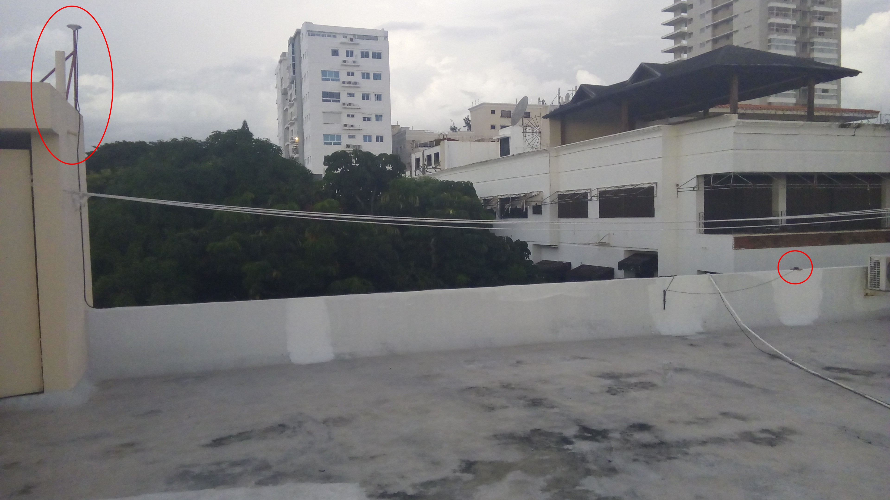
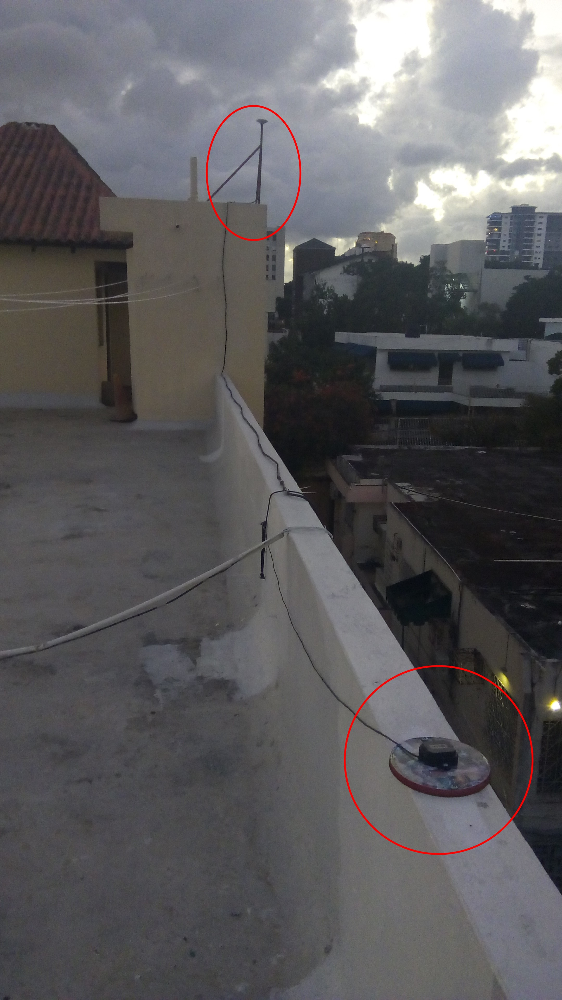
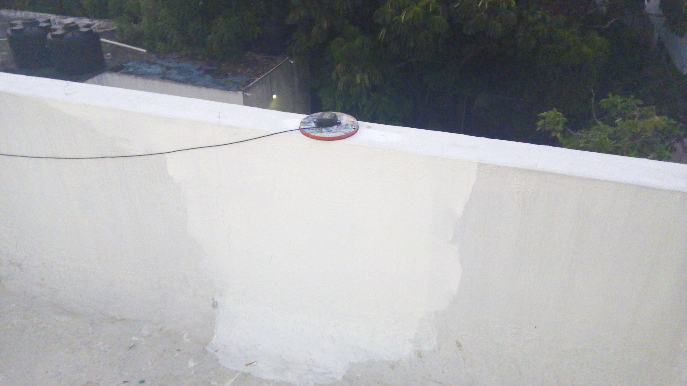

```{r setup, include=FALSE}
knitr::opts_chunk$set(echo = FALSE)
```


# Práctica 2.1: realiza un procesamiento RTK

- Configura RTKNAVI (navegador RTK) de RTKLIB para generar soluciones RTK fix estáticas desde un "rover", el cual se encuentra colocado en el techo de mi edificio), usando correcciones RTCM3 de la base "geofis_ovni" también colocada en el techo de mi edificio. Más detalles, en las sesiones de clases.

## 

## 

## {width=40%}

## 

## ¿Y esto sirve pa'algo?

- Para evaluar y aprender, pero no es práctico en terreno. RTKLIB no es una herramienta de campo, porque demanda muchos recursos de software y hardware para su operación.

## Software para RTK

- En cuanto a software, necesitamos herramientas ligeras y que corran en dispositivos móviles, como la app de Emlid, o aplicaciones programadas al efecto (ver [BashRTKStation](https://github.com/geofis/BashRTKStation) y mi fork de [RTKBase](https://github.com/geofis/rtkbase)). 

## Hardware para RTK

- En cuanto a hardware, hay varias alternativas para obtener soluciones RTK fix. Cito dos:

## Hardware para RTK

- __ALTERNATIVA 1__.

    - Usando el procesador del receptor ZED-F9P, que genera soluciones internas muy precisas. En este caso, es necesario recibir primero las correcciones RTCM (normalmente por Internet) y enviarlas luego al receptor (por ejemplo, por puerto UART). El receptor entonces devuelve las soluciones RTK fijas (por ejemplo, por USB) en formato NMEA, normalmente a los cinco segundos (depende de muchos factores). Para evitar saturación de tráfico, el envío de correcciones y la recepción de soluciones deben fluir por puertos diferentes. 

## Hardware para RTK

- Algunos diseños de comunicación eficientes son:

    - Receptores/transmisores bluetooth que reciban las correcciones desde un celular y las envíen al receptor ZED-F9P; esta alternativa consume poca energía, pero requiere varios pasos de configuración.
    
    - Una PC tipo SBC, como la Raspberry Pi. Dado que corre bajo el núcleo Linux, configurar la conexión es más sencillo. La única desventaja es que consume más energía (preferir la RPi Zero 2).

## Hardware para RTK

- __ALTERNATIVA 2__.

    - Usando el navegador de consola de RTKLIB, `rtkrcv`. Esta alternativa es idónea cuando resulta imposible enviar correcciones RTCM al receptor ZED-F9P (e.g. en ausencia de puerto UART). Su principal desventaja es que requiere programar.

# Práctica 2.2: realiza un procesamiento PPK con RTKLIB

- Realiza un procesamiento PPK utilizando la herramienta de interfaz gráfica RTKPOST de RTKLIB; intenta lo mismo con la herramienta de consola (CLI) denominada `rnx2rtkp`.

- Como fuente de datos rover, utiliza cualquiera de los archivos de extensión `.ubx` de la carpeta `ubx`, conviértelo a formato RINEX con RTKCONV (CLI: `convbin`), examínalo con RTKPLOT.

## Práctica 2: realiza un procesamiento PPK con RTKLIB (cont.)

- Como fuente de datos para la base, utiliza los archivos RINEX `base.*`.

- Representa la solución con RTKPLOT. Genera un KML y visualízalo en GoogleEarth. Intenta representar la solución en QGIS. ¿A qué lugar de RD pertecen estos datos?

- Más detalles, en las sesiones de clases.

# Práctica 2.3: genera un *streaming* ("transmisión")

- Con la aplicación STRSVR, genera un *streaming* usando como fuente el rover; intenta lo mismo desde la consola con la aplicación `str2str`. Explora el resultado en la consola. Crea un archivo y conviértelo usando RTKCONV o `convbin`. Más detalles, en las sesiones de clases.

# REFERENCIAS

<section style="font-size: 24px; text-align: left;">