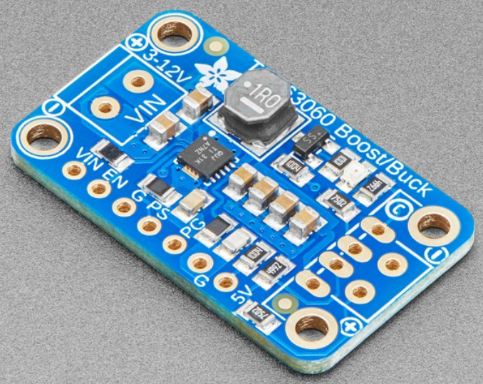

```{r setup, include=FALSE}
knitr::opts_chunk$set(echo = FALSE)
```

# Portal del curso


<small>https://geofis.github.io/rtk-para-todos/curso-sep23-00-portal.html</small>

# Práctica 2. Armando un receptor DIY (1). Diseño de prototipo

## Resultados esperados

Al finalizar esta práctica, las siguientes afirmaciones deberían ser ciertas:

- Conociste (y tocaste) los componentes básicos de un receptor GNSS DIY basado en Raspberry Pi.

- Identificaste los pros y contras del enfoque basado en placas ya prediseñadas, como ArduSimple, Arduino, Raspberry Pi, ESP32, entre otras.

- Elaboraste, de forma colectiva, propuestas de prototipos de receptor GNSS siguiendo especificaciones prestablecidas.

# Pros y contras de los distintos arreglos de componentes

##

| Plataforma        | Pros                                             | Contras                                            |
|-------------------|---------------------------------------------------|----------------------------------------------------|
| Arduino           | Fácil de usar. Gran comunidad. Muchos shields y accesorios compatibles. | Poder de cómputo limitado. Memoria limitada. Puede requerir hardware externo para GNSS. No tiene soporte nativo para multitarea.  |
| ESP32             | WiFi y Bluetooth integrados. Más poder de cómputo. Soporte para multitarea. Precio económico. | Algo más complejo que Arduino. SDK menos amigable para principiantes. Menor cantidad de bibliotecas de terceros. |

##

| Plataforma        | Pros                                             | Contras                                            |
|-------------------|---------------------------------------------------|----------------------------------------------------|
| Raspberry Pi Pico | Económico. Fácil de programar en C/C++ y MicroPython. Soporte para multitarea. | Menos poder de cómputo que otras Raspberry Pi. Puede requerir hardware externo para GNSS. Menos documentación en comparación con Arduino. No tiene WiFi o Bluetooth integrados. |
| Raspberry Pi      | Alto poder de cómputo. Soporte para diversos sistemas operativos. Gran cantidad de bibliotecas y soporte. WiFi y Bluetooth en modelos más nuevos. | Mayor consumo de energía. Más costoso. Puede ser demasiado para aplicaciones sencillas. |

# Instrucciones

- En esta práctica, diseñaremos un receptor GNSS con las funcionalidades y características mencionadas en la siguiente sección, considerando los materiales disponibles (también relacionados a continuación).

- Se trata de dedicar al menos una hora (quizá más) al diseño del prototipo.

- Colocaré los componentes electrónicos y de hardware básico sobre la mesa de trabajo, de manera que puedan colocarse tal como se verían en el prototipo final.

- También mostraré algunos equipos ya armados, pero sólo para que los tengan como referencia.

## Instrucciones

- Nos dividiremos en cuatro grupos (organícense cómo prefieran). 

- Instrucciones para los grupos:

    - IMPORTANTE. Para evitar dañar los componentes electrónicos con nuestra electricidad, es preferible, pero no obligatorio, elegir una persona en el grupo que se encargue de tocar los componentes electrónicos. De forma general, si quieres tocar los componentes, hazlo, pero sólo recuerda antes tocar una superficie metálica (por ejemplo, patas metálicas o laterlaes de una mesa).
    - Organicen su tiempo para que, en 15 minutos, cuenten con una propuesta de distribución de componentes.
    
## Instrucciones

- Instrucciones para los grupos (2):

    - Designar una persona para tomar notas, hacer dibujos, tomar fotos o, quizá mejor, sólo grabar un vídeo de la sesión del grupo.
    - Cada grupo se sentará en torno a los materiales disponibles, y discutirá posibles formas de distribución de los componentes. Yo asistiré en el proceso.

- Dado que uno de los resultados esperados es elaborar propuestas de prototipos, para elegir una que se ensamble finalmente, en teoría deberíamos contar con cuatro propuestas al finalizar la práctica.


# Funcionalidades y características

## Hardware

- Doble frecuencia.

- Colecta de datos brutos.

- Capacidad para RTK, al menos usando protocolo NTRIP.

- Comunicación vía Blutetooth o WiFi a través de móvil.

- Dejar la posibilidad de expandir el diseño para comunicación por radio.

## Hardware

- A prueba de agua.

- A prueba de golpes/caídas.

- Autonomía de batería por al menos 24 horas, para una cadencia de 15 segundos.

- Carga por medio de USB y panel solar.

## Hardware

- Conectores de usuario, entradas/salidas:
    - Terminal de antena, normlamente SMA.
    - Conector de carga USB.
    - Conector de carga para panel solar.
    - Interruptor mecánico o electrónico, *toggle switch* (conmutador, interruptor  de vuelco, de palanca, de selección) o *latch switch* (interruptor de enganche)
    - (Opcional) Por ejemplo, informar sobre: encendido, FIX, conexión inalámbrica lograda, batería por medio de:
        - Pantalla OLED o LCD
        - LEDs de estado

## Capacidades del software

- Garantizar conectividad confiable y durable.

- Recibir y almacenar los mensajes NMEA y datos crudos. Lo recomendable es recibirlos a través del puerto USB, guardarlos en la tarjeta MicroSD de la Raspberry y, al mismo tiempo, redireccionarlos a un puerto TCP, desde donde el/la usuario/a podrá "escucharlos" para desplegarlos en aplicaciones.

- Posibilidad de enviar correcciones RTCM al receptor.

- Posibilidad de descarga datos crudos.

- Otras.

# Materiales disponibles

- La lista de materiales disponibles podría ser muy larga, pero relaciono los imprescindibles a continuación:

## Dispositivo de control, Raspberry Pi

- Para facilitar la programación, usaremos [Raspberry Pi Zero W](https://www.raspberrypi.com/products/raspberry-pi-zero-w/)

{width=35%}

## Receptor GNSS

- En nuestro caso, usaremos la placa simpleRTK2B (AS-RTK2B-FP9-L1L2-NH02) de la marca ArduSimple, que incluye un módulo GNSS u-blox ZED-F9P de doble frecuencia.

- [Esta guía](https://www.ardusimple.es/simplertk2b-hookup-guide/) de conexión es bastante útil.

## Circuito de alimentación de energía

- Circuito de alimentación, que permita selección de una entre entradas alimentación (batería, USB, panel solar) con suministro de corriente ininterrumpida. Esto incluye el módulo MCP73871 de DIYMore (selecciona entre entradas de alimentación) y el módulo Verter de Adafruit (regula voltaje, reductor, elevator).

  {width=35%}
{width=38%}

## Baterías

- La autonomía requerida entre las funcionalidades/características, exige colocar una batería de al menos 6Ah, preferiblemente de 10Ah

- No está disponible en el mercado local esta batería, pero sería una buena alternativa: 

- En el mercado local sí está disponible la 18650, aunque ocupa un 

## Caja, cerramiento, *enclosure*

- Teóricamente, el proyecto debería comenzar en este punto.

- Si tuviésemos impresora 3D, podríamos hacer pruebas. Para ello, primero habría que diseñar una caja en software CAD, enviar el diseño a impresión y, posteriormente, probar y aplicar correctivos.

- La duración de este curso hace inviable esta alternativa. Nuestras alternativas son cajas, cerramientos o *enclosures* disponibles en el mercado.

## 

- Una alternativa muy usada en proyectos DIY son las cajas de registro eléctrico. Un ejemplo a continuación: [caja de conexiones de 130x85x80 mm](https://www.amazon.com/YXQ-250x150x100mm-Transparent-Waterproof-Enclosure/dp/B07KXR25LJ) (es un poco menos en realidad), con cubierta transparente de policarbonato ABS IP66 a prueba de agua.

- Aunque es una opción viable, porque la tenemos en el mercado local (JH Electro Alambres), no deberíamos cerrarnos a esta opción. Debemos pensar distintas posibilidades, sobre todo si queremos lograr que sea a prueba de golpes/caídas.

##

{width=80%}

# REFERENCIAS

<section style="font-size: 24px; text-align: left;">