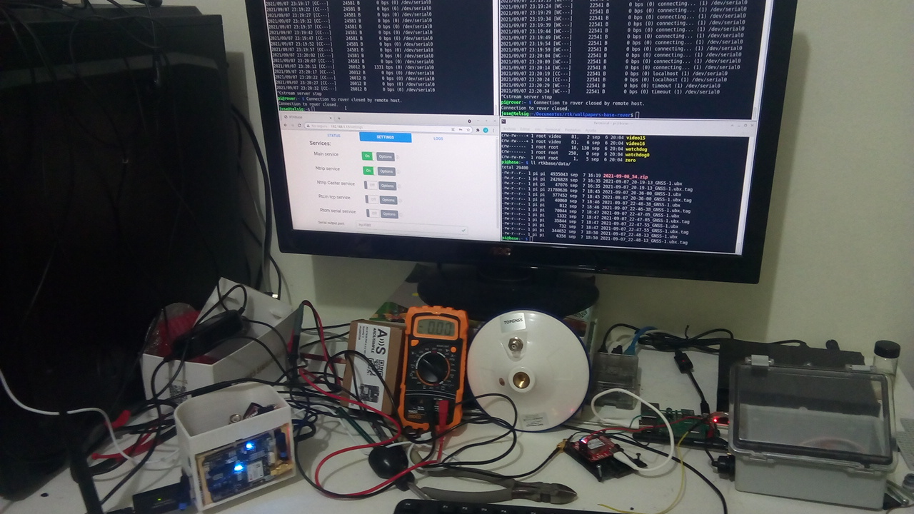
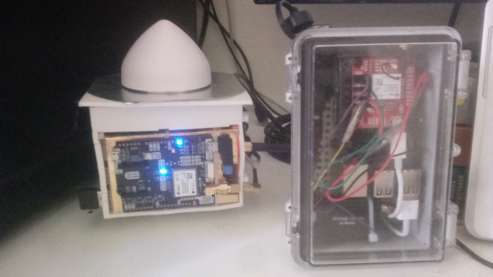
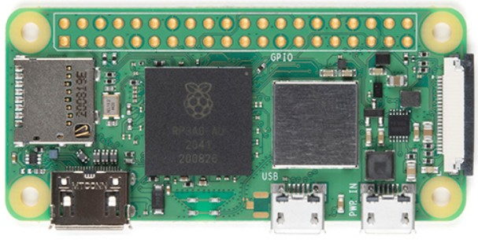
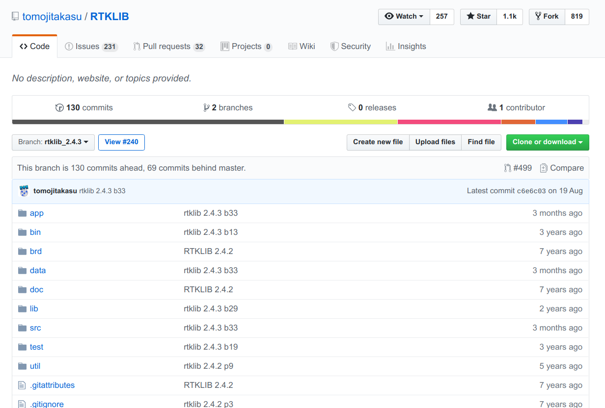
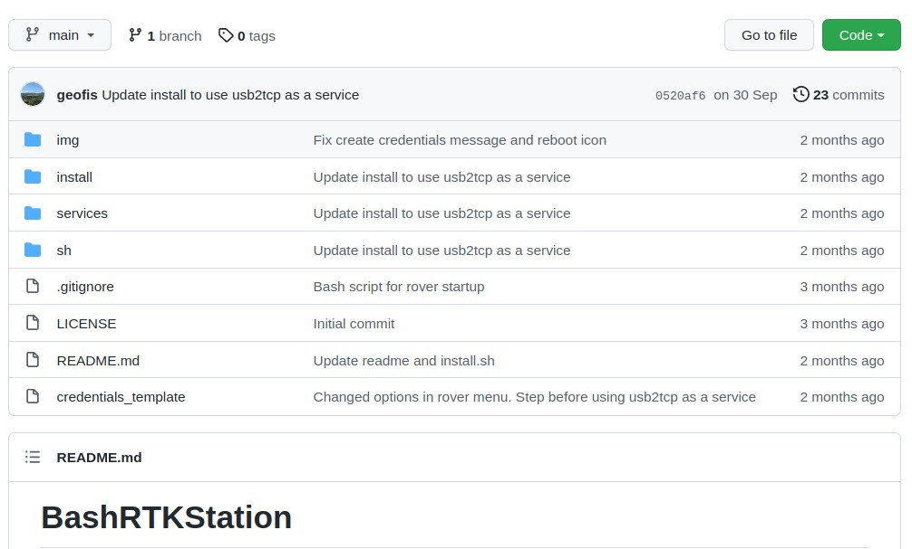
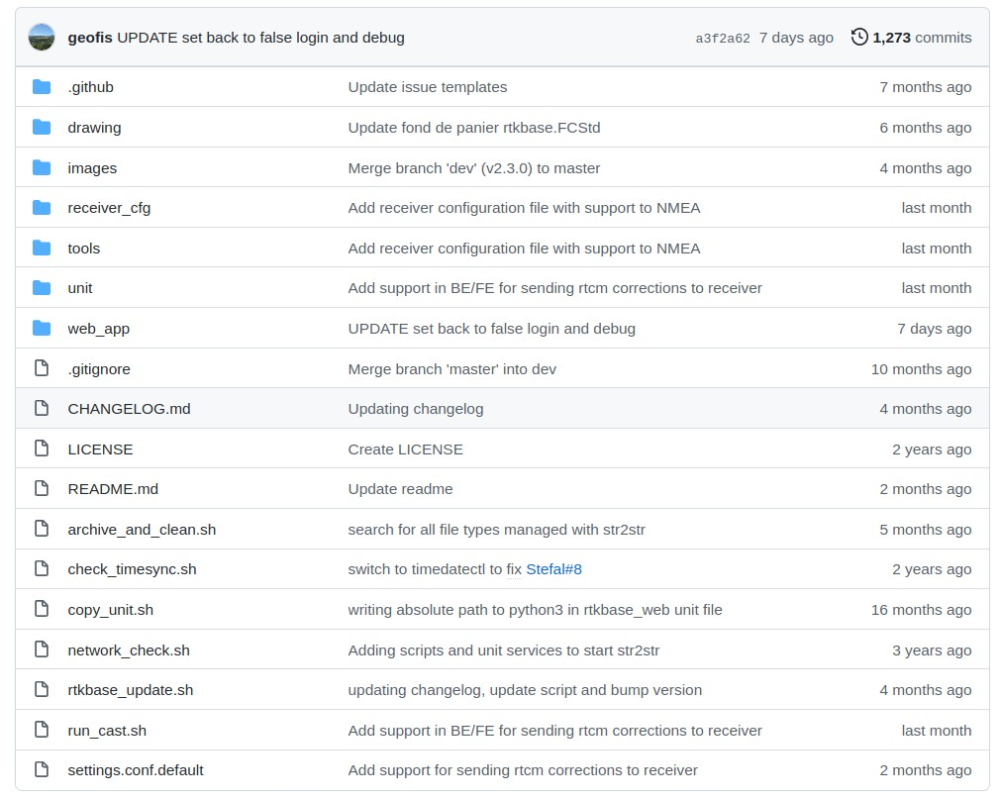
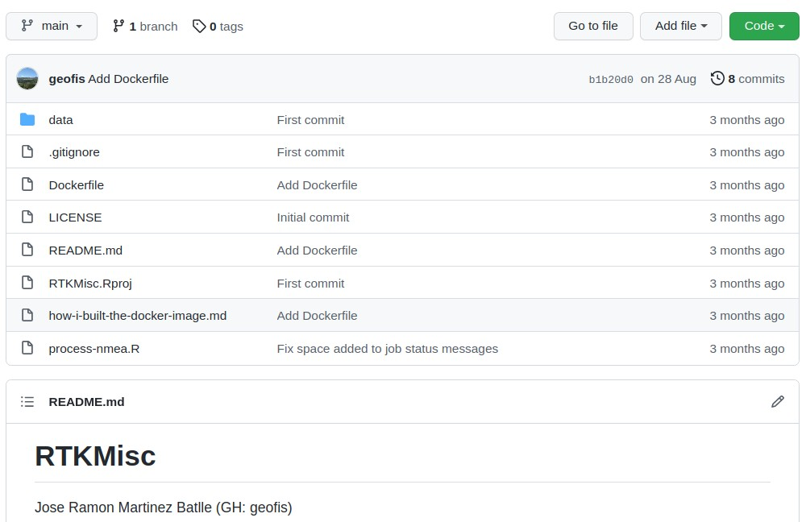
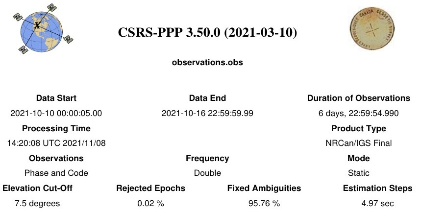
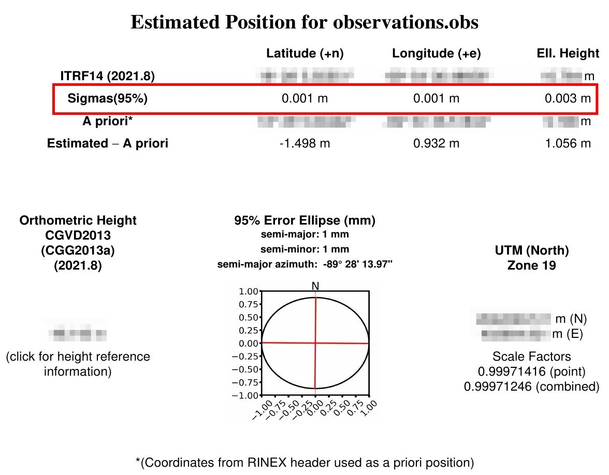
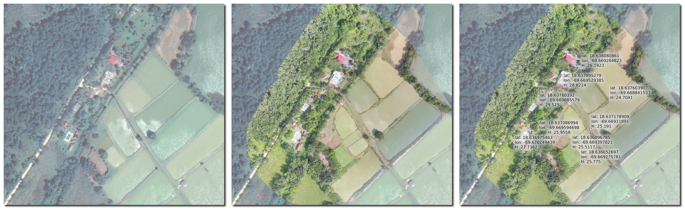

```{r setup, include=FALSE}
knitr::opts_chunk$set(echo = FALSE)
```

# PREÁMBULO

## Portal del curso


<small>https://geofis.github.io/rtk-para-todos/curso-sep23-00-portal.html</small>

## Autopresentación (a las 4 pm, en el aula FC-101)

- Incluye nombre, profesión, municipio de residencia, expectativas y cualquier otro detalle que quieras agregar.

## Recomendaciones

- Tumba el miedo a la consola de comandos.

- Cambia la expresión "da error" por "obtuve un error que me parece tiene que ver con <inserta aquí tu sospecha>, el cual dice lo siguiente: <inserta aquí tu mensaje de error favorito>. Intenté resolverlo por mi cuenta mediante <inserta aquí las soluciones que implementaste>, pero no tuve éxito".

- Bájale todo lo que puedas a las expectativas. La fortaleza de este curso no es su contenido, sino la libertad. Te adelanto que el contenido será mínimo, pero al menos conocerás soluciones libres para aprender el enorme volumen de temas restantes.

# ¿Qué son los sistemas globales de navegación por satélite (GNSS)?

- PNT: position, navigation and timing.

- Dead reckoning

- El recurso más eficiente disponible son los sistemas de navegación por satélite.

- Las versiones con cobertura global de estos sistemas, se denominan sistemas de navegación global por satélite o "GNSS" (siglas de Global Navigation Satellite Systems)

##

- Un GNSS es un sistema que permite (pero no sólo) determinar la posición de un objeto en la Tierra utilizando señales emitidas por satélites en órbita. GPS, GLONASS, Galileo y BeiDou, son ejemplos de sistemas GNSS.

- La modalidad que provee coordenadas precisas al instante se denomina "navegación cinética satelital en tiempo real" o "GNSS-RTK" o, simplemente "RTK" (de *real-time kinematics*).

- Tanto la tecnología GNSS en general, como su modalidad RTK, son muy útiles en aplicaciones de geografía física (especialmente en geomorfología), agrimensura, topografía, agricultura de precisión, entre otras disciplinas.

## Comparación entre técnica estándar y basada en onda portadora

|     |     |     |
|:---:|:---:|:---:|
|     | Basada en códigos pseudoaleatorios (estándar) | Posicionamiento preciso (basada en onda portadora) |
| Observaciones | Pseudorango (de códigos)| Onda portadora + pseudorango |
| Precio de receptor | Baratos, ~US\$100 | __Muy caros ~US\$10,000-40,000__ |
| Exactitud | 3 m (H), 5 m (V) | __5 mm (H) 1 cm (V) (modo estático)__ |
| Aplicaciones | Navegación marítima, búsqueda y rescate | Topografía, mensura, cartografía de alta precisión |
<small>Los costos son para equipos funcionales listos para usarse, "apenas sacados de su empaque"</small>

## Limitaciones globales

- Alto __costo de equipos__ listos para usar.

- Predominio de __soluciones__ de software privativas.

- Red de CORS pública de __poca densidad__.

- __Redes privadas__ existentes y densas, aunque de __costos__ elevados.

# Software libre, software de código abierto

{width=70%}

Según [Slava Todavchich, Moqod.com](https://moqod-software.medium.com/understanding-open-source-and-free-software-licensing-c0fa600106c9)

# Hardware libre

- Son componentes físicos de computadoras y otros dispositivos que están diseñados de manera abierta y pública

- Las especificaciones, diagramas esquemáticos y todo el material necesario para fabricar, modificar y reparar el hardware son de acceso público.

##

- Al igual que en el caso del software libre, el objetivo es fomentar la colaboración, la innovación y la libertad de los usuarios para adaptar el hardware a sus necesidades específicas.

- Los receptores GNSS, aunque sean de bajo costo, no son necesariamente libres.


# Un ejemplo de proyecto DIY ("hazlo tu mismo") que incluye FLOSS, hardware libre y cerrado

- Se trata de un proyecto autofinanciado, que constituye un __soporte esencial__ para otras múltiple investigaciones en marcha.

- Por lo tanto, su importancia radica en la capacidad de soportar __múltiples aplicaciones en geografía y mensura (entre otras áreas) a bajísimo costo y con soluciones libres, SIN SOFTWARE PRIVATIVO NI HARDWARE COSTOSO.__

## Fabricantes de receptores GNSS con capacidad RTK

- Trimble, Leica, Topcon, NovAtel, JAVAD, ...

- u-blox, Septentrio, Skytraq, ComNav Technology, Unicore Communications ...

## {width=85%}

## 

## Soluciones de software libre / código abierto

- La mayor parte de los equipos anteriores usan software privativo creado por el fabricante. Por lo tanto, con dicho software no es posible:

  - Estudiar ni mejorar las soluciones.
  - Compartir el código con colegas.

- En cambio, con software libre/código abierto, sí es posible.

{width=60%}

## Aplicaciones

* Monitoreo de __deslizamientos, fallas__.

* Mensura.

* Fotogrametría con __UAV__.

* Construcción, monitoreo de __edificaciones y estructuras__ (puentes)

* __Agricultura__ de precisión.

* Detección de __tsunamis__ por boyas GNSS.

* Sistemas de __transporte__, vehículos autónomos.

##

* Sistemas de cartografía __móviles__ (Street View).

* Niveles de lagos, humedad de suelo, etc., por medio de reflexión GNSS.

* Estimación de vapor de agua de atmósfera.

## ¿Cuándo comencé?

- En __2018__ construí una solución monobanda.

- Dicha solución, aunque útil para determinadas aplicaciones, fallaba en determinados ambientes para __converger eficientemente__ (AR).


## ¿Cuándo comencé?

- Desde entonces me concentré en:

    - Construir una __solución integral__, que incluyera __base y rover ambos de doble frecuencia__.
    
    - Crear __scripts de operación básicos__, así como mejorar/adaptar software de terceros, basándome sobre todo en RTKLIB.

# MATERIALES Y MÉTODOS

## Hardware

## 

## 

## 

## 

## 

## <span style="font-size:60%;">Partes adquiridas para equipo de colecta (Financiamiento: "SALARIO-CyT")</span>

| Parte                                                                         | Costo aprox.|
|-------------------------------------------------------------------------------|------------:|
| Base o rover, los imprescindibles: receptor, RPi, antena.                     |    US$340   |
| Adaptador de corriente, palo, trípode, conectores, cables, carcasa, batería   |    US$240   |

<span style="font-size:60%; float:left;">- No se incluyen fletes.</span>

<span style="font-size:60%; float:left;">- Para una base fija tipo CORS, se deben añadir los costes del __soporte de hierro__ (~US$40) y __el cable__ (el valor dependerá del calibre elegido y la longitud del mismo). Otros complementos deseables son un __tribrach__ (base nivelante), __protección contra rayos__ y una estación meteorológica.</span>

## ¿Qué es una Raspberry Pi?

{width=35%}
{width=35%}

## Software

## RTKLIB

* Biblioteca [RTKLIB](http://www.rtklib.com/) (primera versión, 2007), por Tomoji Takasu [@takasu2011rtklib; @takasu2009development]


## RTKLIB



## RTKLIB


## BashRTKStation

* Colección de scripts [BashRTKStation](https://github.com/geofis/BashRTKStation/)

{width=50%}


- https://github.com/geofis/BashRTKStation/

## RTKBase

* Fork propio de RTKBase para usarlo:
    * __En la base__.
    * También __en el rover__, pues tiene capacidad de envíar correcciones RTCM3 a receptor.

## {width=75%}

- https://github.com/geofis/rtkbase

## 

## Centipede


- https://centipede.fr/

## RTKMisc

{width=80%}

- https://github.com/geofis/RTKMisc

## Iniciativas recientes

- GEODNet

- Empresas: Emlid, AlphaGeo

# Algunos resultados

## Solución PPP para la base (NRCAN)



## Solución PPP para la base (NRCAN)



## Comparación soluciones NRCAN y AUSPOS


## Campus UASD

## 

## 

## {width=70%}

## 

## {width=80%}

## Playa Najayo


## Playa Najayo


## Obras


## Mensura



## Hundimiento en César Nicolás Penson


## rtk2go. Servicio público

{width=55%}

<small>- URL: rtk2go:2101, Mountpoint: geofis_ovni</small>
<small>- Status: [http://rtk2go.com:2101/SNIP::MOUNTPT?NAME=geofis_ovni](http://rtk2go.com:2101/SNIP::MOUNTPT?NAME=geofis_ovni)</small>

# PERSPECTIVAS

* Dar __capacitaciones__ básicas. __Apoyo personas abiertas a Linux, software libre y consola de comandos__.

* Monitorear __deslizamientos__.

* Caracterizar __granulometría de carga gruesa__ superficial de lechos de río/llanura de inundación mediante UAV.

* Monitorear __deformación en SD__, con énfasis en la UASD.

# REFERENCIAS

<section style="font-size: 24px; text-align: left;">