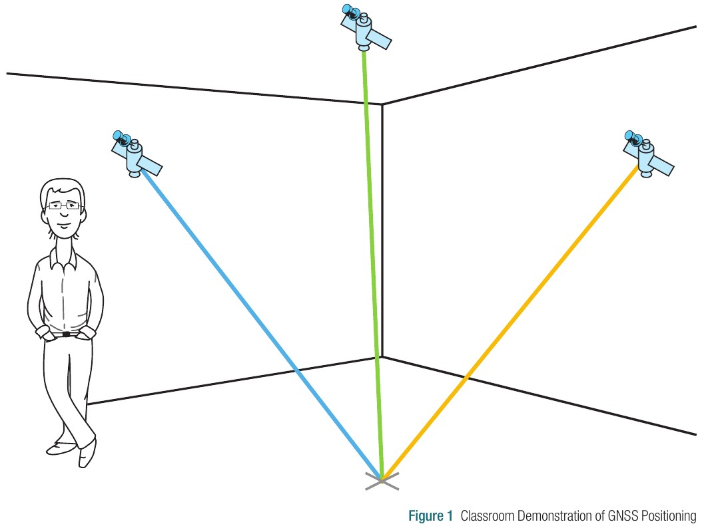
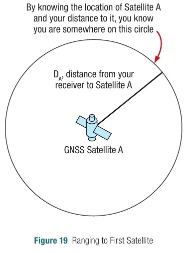
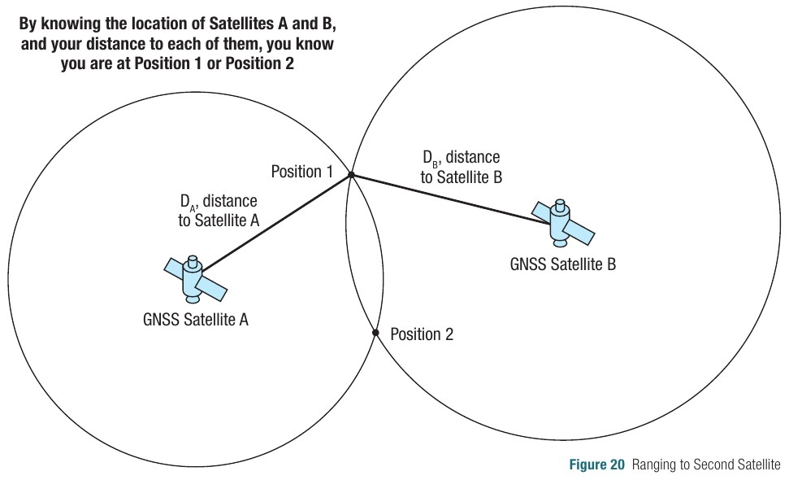
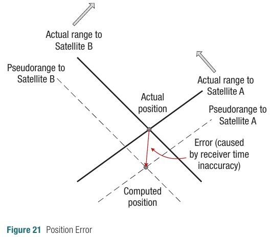
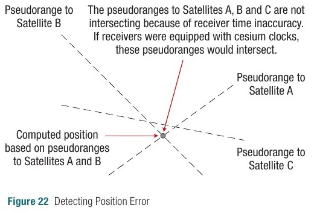
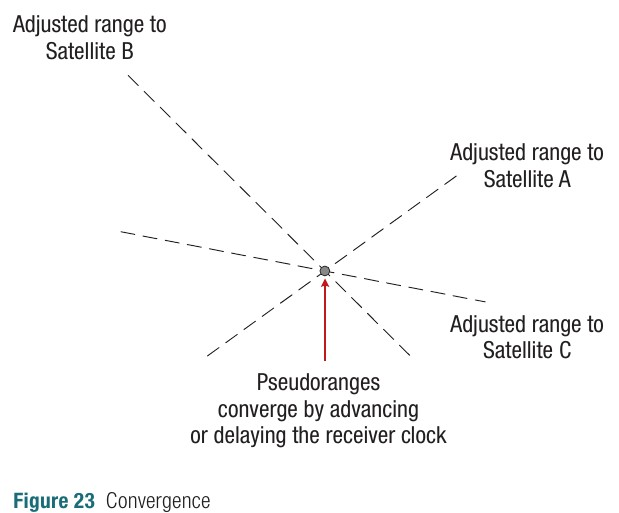
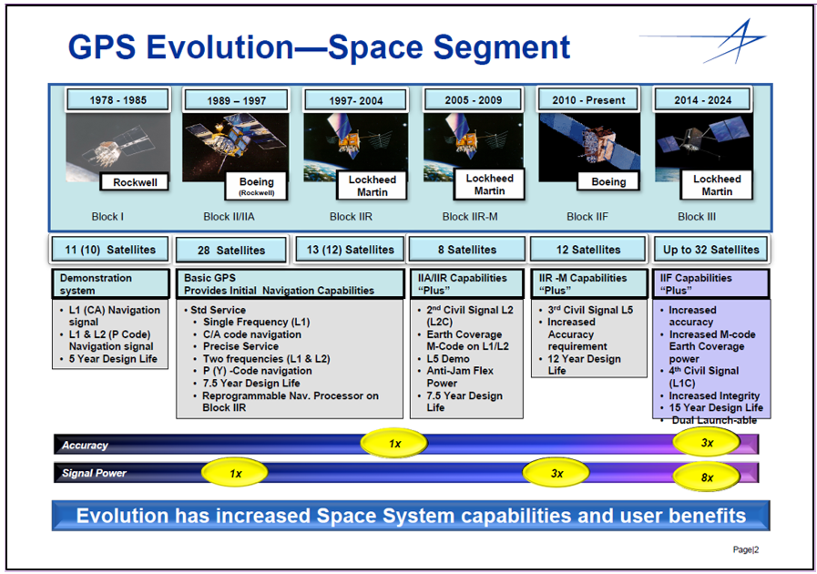
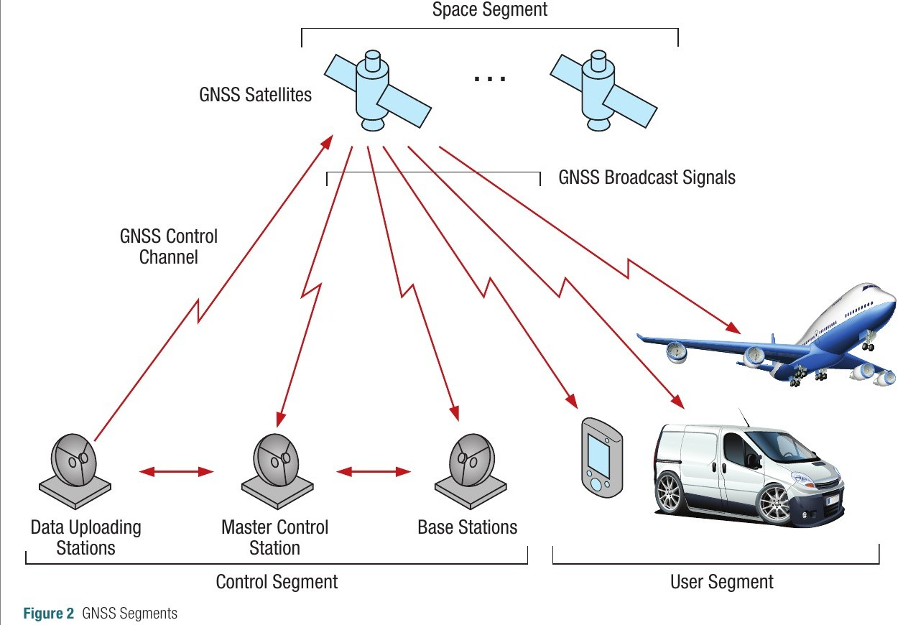
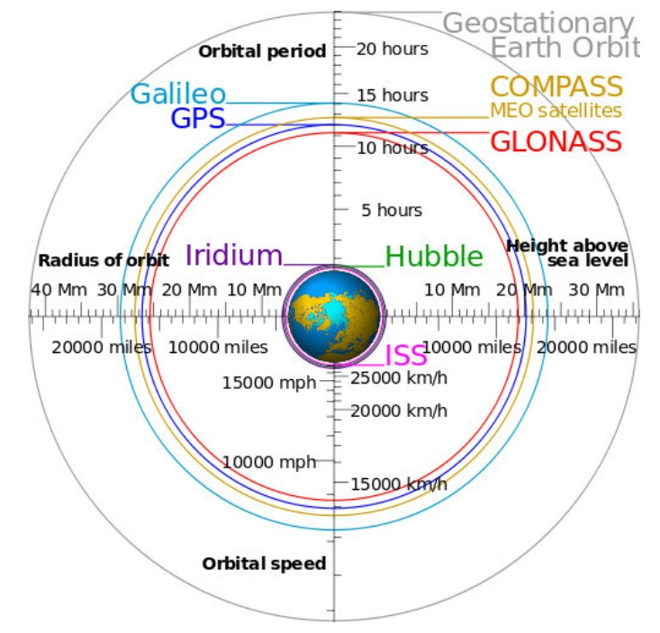

```{r setup, include=FALSE}
knitr::opts_chunk$set(echo = FALSE)
```

# Vistazo general

## Tus coordenadas

- Te encuentras en el punto $a$ del espacio $xyz$, con coordenadas $x_a,y_a,z_a$ ...

- ... y conoces las distancias ($d_1,d_2,d_3$) que te separan de tres puntos conocidos, e igualmente conoces las posiciones de dichos puntos $(x_1,y_1,z_1),...,(x_4,y_4,z_4)$.

- Pues resolviendo un sencillo sistema de ecuaciones, podrás determinar tu posición $x_a,y_a,z_a$ en el espacio $xyz$.

## {width=80%}

Según @novatel2015introduction

## Tus coordenadas

- Hasta aquí todo bien, pero pero ...

- ¿Y no que se necesitan 4 satélites para obtener una coordenada?

Veamos esquemáticamente con un ejemplo bidimensional:

## 

Según @novatel2015introduction

## 

Según @novatel2015introduction

## {width=70%}

Según @novatel2015introduction

## {width=140%}

Según @novatel2015introduction

## 

Según @novatel2015introduction

# Evolución

{width=80%}
<small>Fuente: https://gssc.esa.int/navipedia/index.php/GPS_Space_Segment</small>

# Segmentos

## 

Según @novatel2015introduction.

## ¿GPS? ¿GNSS?

- GPS = *Global Positioning System*, sistema de posicionamiento global, es una constelación actualmente.

- GNSS = *Global Navigation Satellite System*, sistema de navegación global por satélite. Múltiples constelaciones existen hoy.

## Constelaciones

- GPS. EUA, desde 70s, 27 satélites, ámbito global.

- GLONASS=Global Navigation Satellite System (ГЛОНАСС=ГЛОбальная НАвигационная Спутниковая Система). Rusia, desde 80s, 24 satélites, ámbito global.

- Galileo=sistema europeo de radionavegación y posicionamiento por satélite. Unión Europea, desde 2011, 24 satélites operativos, ámbito global.

- BeiDou=sistema de navegación por satélite (BDS=北斗卫星导航系统). China, desde 2000, 35 satélites en órbita, ámbito global.

- IRNSS, QZSS. Constelaciones india y japonesa de ámbito local

## Segmento espacial

- Cada constelación tiene un número determinado de satélites, normalmente a más de 20,000 km sobre la superficie de la Tierra (nivel del mar como referencia).

- Cada satélite transmite mensajes con, por lo menos, los siguientes mensajes:  identidad (número/código identificador), hora precisa, órbita y estado.

## 

## Segmento de control

- Red de estaciones en tierra de los siguientes tipos:

    - Control maestro (ajuste de órbita; para GPS hay dos, una primaria y otra de respaldo).
    
    - Subida de información (4 estaciones en GPS).
    
    - Monitoreo (monitorean la señal y estado; 16 estaciones en GPS).

## Segmento usuario

- Consiste en el personal y equipamiento para recibir y procesar la señal de las constelaciones GNSS.

- Es el segmento masivo.

# Señales GNSSS

## Frecuencias

- En torno a los 1.5 GHz (gigahercios), 1500 millones de ciclos (1.5 millardos de ciclos).

```{r, echo=T}
wl <- 29979245800/1500000000
cat('Longitud de onda = ', wl, 'cm')
```

- Son ondas con frecuencias mayores a las de la radiodifusión, pero inferiores a las del microondas.


# REFERENCIAS


<section style="font-size: 24px; text-align: left;">