```{r setup, include=FALSE}
knitr::opts_chunk$set(echo = FALSE)
```


# Vistazo general

## Tus coordenadas

- Te encuentras en el punto $a$ del espacio $xyz$, con coordenadas $x_a,y_a,z_a$ ...

- ... y conoces las distancias ($d_1,d_2,d_3$) que te separan de tres puntos conocidos, e igualmente conoces las posiciones de dichos puntos $(x_1,y_1,z_1),...,(x_4,y_4,z_4)$.

- Pues resolviendo un sencillo sistema de ecuaciones, podrás determinar tu posición $x_a,y_a,z_a$ en el espacio $xyz$.

## {width=80%}

Según @novatel2015introduction

## Tus coordenadas

- Hasta aquí todo bien, pero pero ...

- ¿Y no que se necesitan 4 satélites para obtener una coordenada?

Veamos esquemáticamente con un ejemplo bidimensional:

## 

Según @novatel2015introduction

## 

Según @novatel2015introduction

## {width=70%}

Según @novatel2015introduction

## {width=140%}

Según @novatel2015introduction

## 

Según @novatel2015introduction

# Evolución

{width=80%}
<small>Fuente: https://gssc.esa.int/navipedia/index.php/GPS_Space_Segment</small>

## 

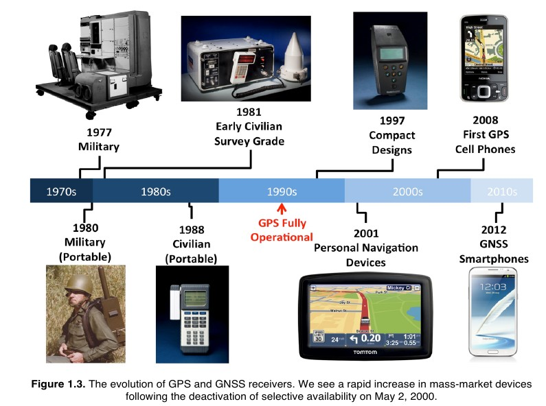{width=80%}
Fuente: @reid2017orbital

# Segmentos

## 

Según @novatel2015introduction.

## ¿GPS? ¿GNSS?

- GPS = *Global Positioning System*, sistema de posicionamiento global, es una constelación actualmente.

- GNSS = *Global Navigation Satellite System*, sistema de navegación global por satélite. Múltiples constelaciones existen hoy.

## Constelaciones

- GPS. EUA, desde 70s, 27 satélites, ámbito global.

- GLONASS=Global Navigation Satellite System (ГЛОНАСС=ГЛОбальная НАвигационная Спутниковая Система). Rusia, desde 80s, 24 satélites, ámbito global.

- Galileo=sistema europeo de radionavegación y posicionamiento por satélite. Unión Europea, desde 2011, 24 satélites operativos, ámbito global.

- BeiDou=sistema de navegación por satélite (BDS=北斗卫星导航系统). China, desde 2000, 35 satélites en órbita, ámbito global.

- IRNSS, QZSS. Constelaciones india y japonesa de ámbito local

## Segmento espacial

- Cada constelación tiene un número determinado de satélites, normalmente a más de 20,000 km sobre la superficie de la Tierra (nivel del mar como referencia).

- Cada satélite transmite mensajes con, por lo menos, los siguientes mensajes:  identidad (número/código identificador), hora precisa, órbita y estado.

## {width=75%}

## Segmento de control

- Red de estaciones en tierra de los siguientes tipos:

    - Control maestro (ajuste de órbita; para GPS hay dos, una primaria y otra de respaldo).
    
    - Subida de información (4 estaciones en GPS).
    
    - Monitoreo (monitorean la señal y estado; 16 estaciones en GPS).

## Segmento usuario

- Consiste en el personal y equipamiento para recibir y procesar la señal de las constelaciones GNSS.

- Es el segmento masivo.

# Frecuencia, señal y código en sistemas GNSSS

En el contexto de los GNSS:

1. **Frecuencia**: Tasa de oscilación de la onda, determina velocidad y penetración de la señal.

2. **Señal**: onda electromagnética que transmite información.
  
3. **Código**: Datos binarios que modulan la señal para identificación y medición de distancia.

- Resumiendo: frecuencia es la base de la señal, y código es la información modulada sobre la señal.

## Frecuencias en sistemas GNSS

- Son ondas con frecuencias mayores a las de la radiodifusión, pero inferiores a las del microondas.

- La banda en la cual se encuentran se denomina "Banda L", y algunos satélites de observación de la tierra que usan la tecnología de radar de apertura sintética usan esta banda. 

- Existe evidencia, al menos de laboratorio, de que podría existir interferencia entre señales emitidas por sensores activos de satélites SAR (e.g. ALOS-2) y las señañes de los sistemas GNSS.

## Frecuencias del espectro electromagnético

- Estas son las frecuencias del espectro electromagnético usadas por distintos vehículos satelitales GPS y GLONASS:

- **GPS (EE. UU.)** (CDMA):
  - L1: 1575.42 MHz
  - L2: 1227.60 MHz
  - L5: 1176.45 MHz

- **GLONASS (Rusia)** (FDMA):
  - L1: 1602 + k MHz
  - L2: 1246 + k MHz

## Frecuencias del espectro electromagnético

- Estas son las frecuencias del espectro electromagnética usadas por distintos vehículos satelitales Galileo y BeiDou:

- **Galileo (UE)**:
  - E1: 1575.42 MHz
  - E5a: 1176.45 MHz
  - E5b: 1207.14 MHz
  - E6: 1278.75 MHz

- **BeiDou (China)**:
  - B1: 1561.098 MHz
  - B2: 1207.14 MHz
  - B3: 1268.52 MHz

##

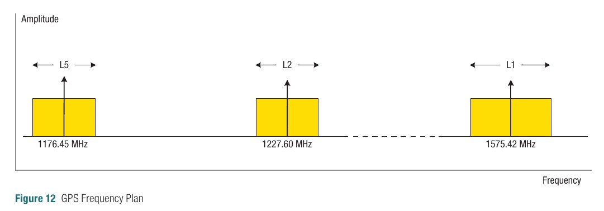

Fuente: @novatel2015introduction

##

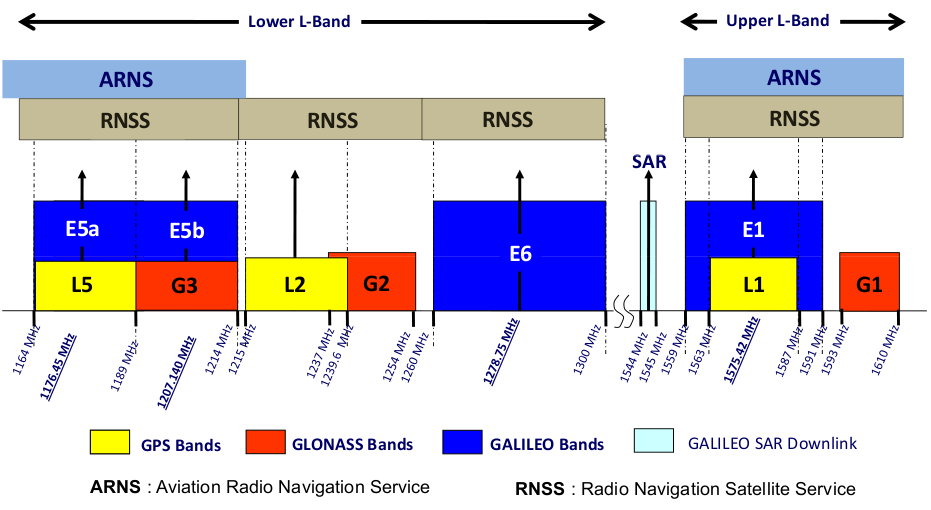

Fuente: https://gssc.esa.int/navipedia/index.php/GNSS_signal

## Longitud de onda

$\lambda = c/f$

- Determinemos la longitud de una onda de 1.5 GHz (gigahercios) de frecuencia, es decir, de 1500 millones de ciclos (1.5 millardos de ciclos; NO confundir con "billón", pues a diferencia del inglés, billón equivale a "un millón de millones", mientras que el *billion* es "mil millones").

```{r, echo=T}
wl <- 29979245800/1500000000
cat('Longitud de onda = ', wl, 'cm')
```

## Códigos

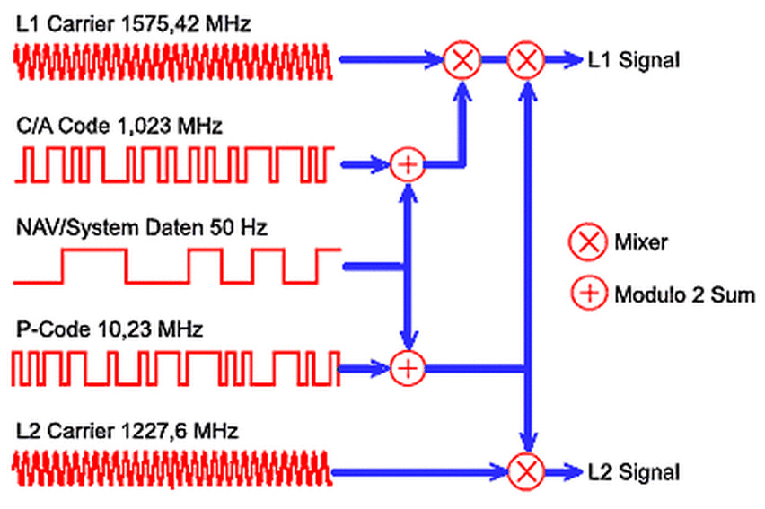
Fuente: https://ee3550-gps.weebly.com/transmission-of-gps-signals.html

## Modulación

- Hay distintas formas de modulación: por amplitud, por frecuencia y por fase.

- **Los sistemas GNSS utilizan modulación por fase, específicamente BSFK *binary phase shift keying***.

## ¿Por qué usar modulación por fase?

1. **Resistencia al ruido**: Menos sensible a interferencias.
  
2. **Eficiencia espectral**: Mejor uso del espectro limitado.
  
3. **Precisión**: Mayor exactitud en tiempo y posición.
  
4. **Integridad de señal**: Correcciones de errores más efectivas.

5. **Multiplexación**: Facilita combinar múltiples señales.

6. **Compatibilidad**: Flexibilidad para actualizar o mejorar el sistema.

## 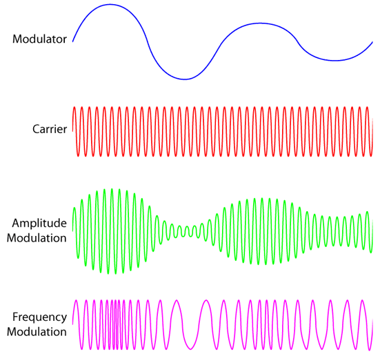

<small>Fuente: https://mriquestions.com/signal-squiggles.html</small>

## 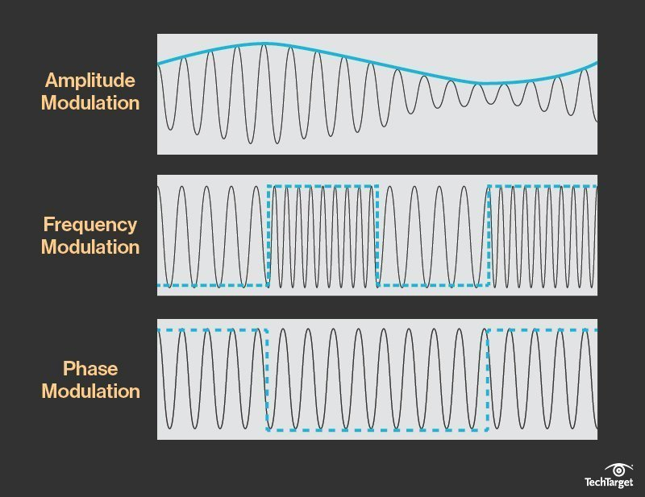

<small>Fuente: https://www.techtarget.com/searchnetworking/definition/QAM</small>

## Espectro ensanchado

- Una consecuencia de este método de modulación es que la señal GPS usa un "espectro ensanchado" para ocupar un ancho de banda mayor al necesario para la información que transmite.

- Señales L1, L2, L5 tienen anchos de banda más grandes de lo que sus frecuencias centrales sugieren.
  
- C/A ocupa 2.046 MHz, P(Y) en L1 abarca 20.46 MHz, y la futura L1C será de 4.092 MHz.

## 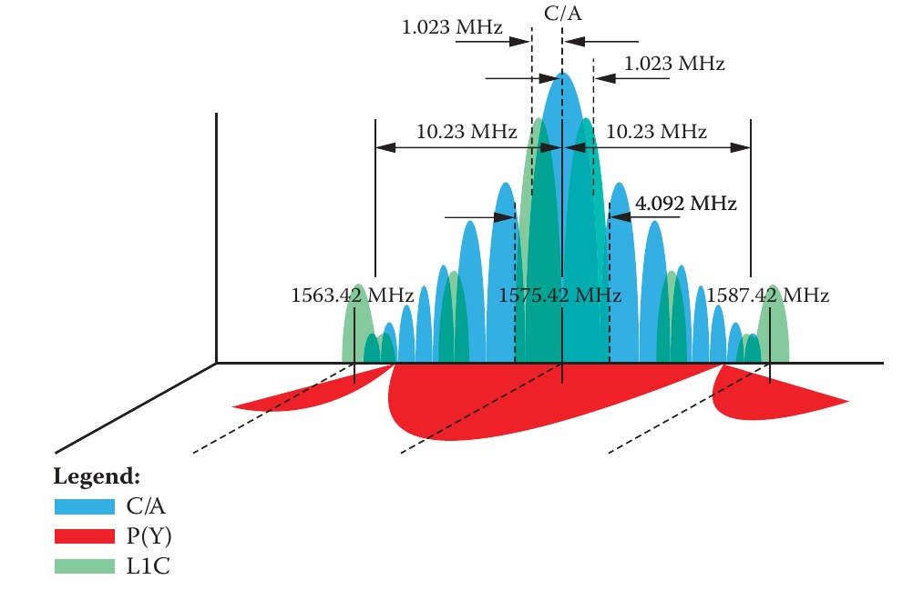

Fuente: @sickle2015gps

## Tasa fundamental

- La tasa de todos los componentes de las señales del GPS son múltiplos de la tasa estándar ("fundamental") de los osciladores.

- La tasa estándar es de 10.23 MHz. Se conoce como la tasa de reloj fundamental y se simboliza como $F_0$. Por ejemplo, las portadoras del GPS son $154\times F_0$, o 1575.42 MHz, $120\times F_0$, o 1227.60 MHz, y $115\times F_0$, o 1176.45 MHz. Estas representan a L1, L2 y L5 respectivamente.

## Modulación de códigos

## 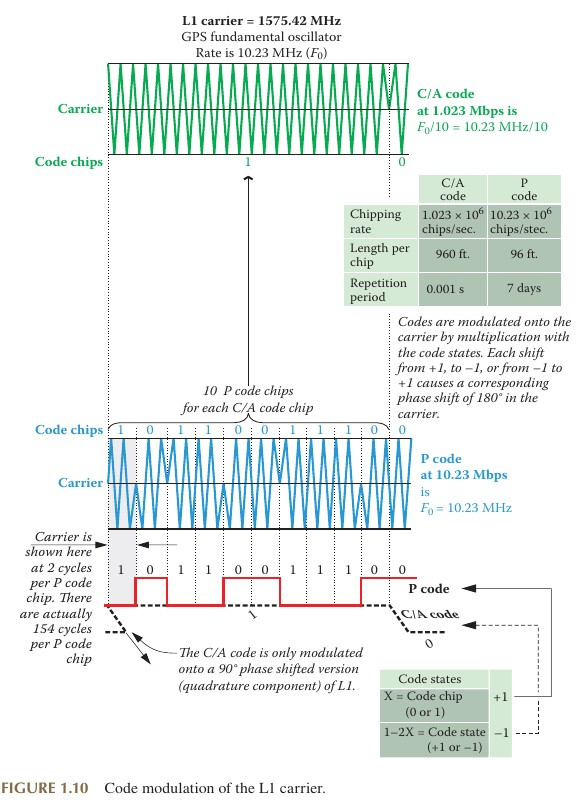{width=50%}

<small>Fuente: @sickle2015gps</small>

## Modulación de códigos

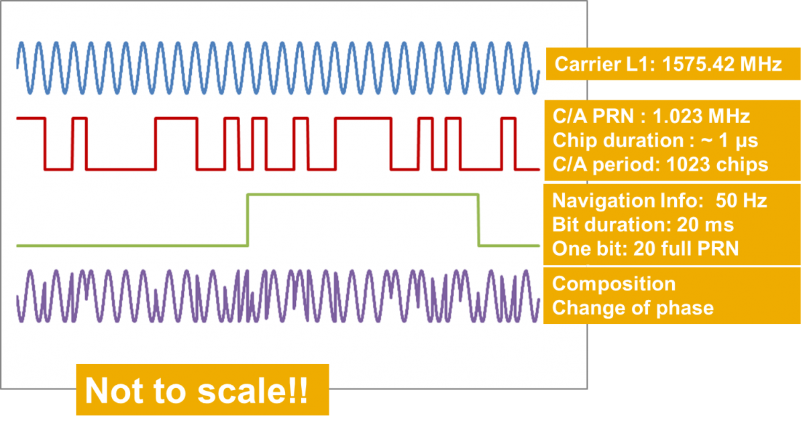

<small>Fuente: https://gssc.esa.int/navipedia/index.php/GNSS_signal</small>

## ¿Cómo determinar el tiempo de propagación (distancia) usando códigos?

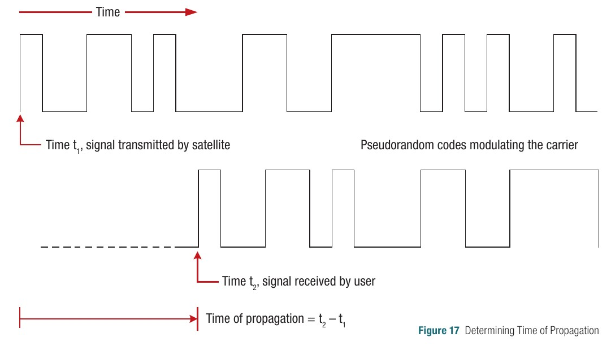

Fuente: @novatel2015introduction

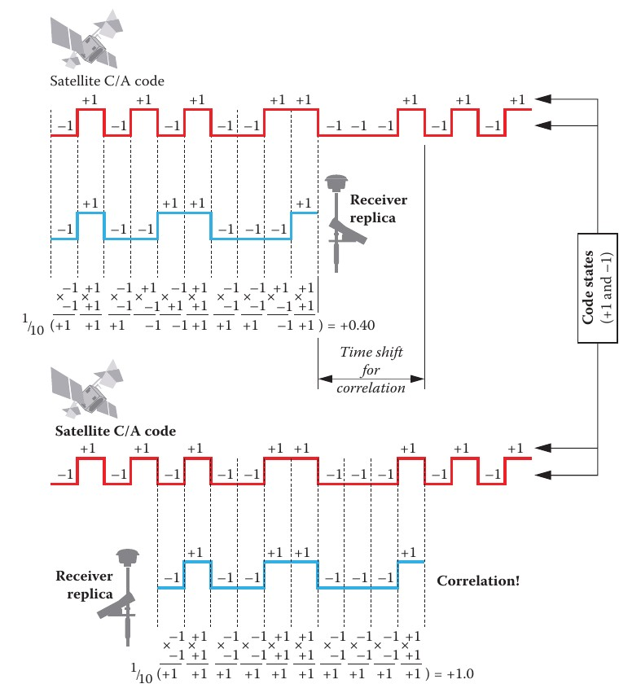

Fuente: @sickle2015gps


# Comencemos de nuevo

## Tus coordenadas

- Te encuentras en el punto $a$ del espacio $xyz$, con coordenadas $x_a,y_a,z_a$ ...

- ... y conoces las distancias ($d_1,d_2,d_3$) que te separan de tres puntos conocidos, e igualmente conoces las posiciones de dichos puntos $(x_1,y_1,z_1),...,(x_4,y_4,z_4)$.

- Pues resolviendo un sencillo sistema de ecuaciones, podrás determinar tu posición $x_a,y_a,z_a$ en el espacio $xyz$.

## {width=80%}

Según @novatel2015introduction

## Tus coordenadas

- Hasta aquí todo bien, pero pero ...

- ¿Y no que se necesitan 4 satélites para obtener una coordenada?

Veamos esquemáticamente con un ejemplo bidimensional:

## 

Según @novatel2015introduction

## 

Según @novatel2015introduction

## {width=70%}

Según @novatel2015introduction

## {width=140%}

Según @novatel2015introduction

## 

Según @novatel2015introduction


# REFERENCIAS


<section style="font-size: 24px; text-align: left;">