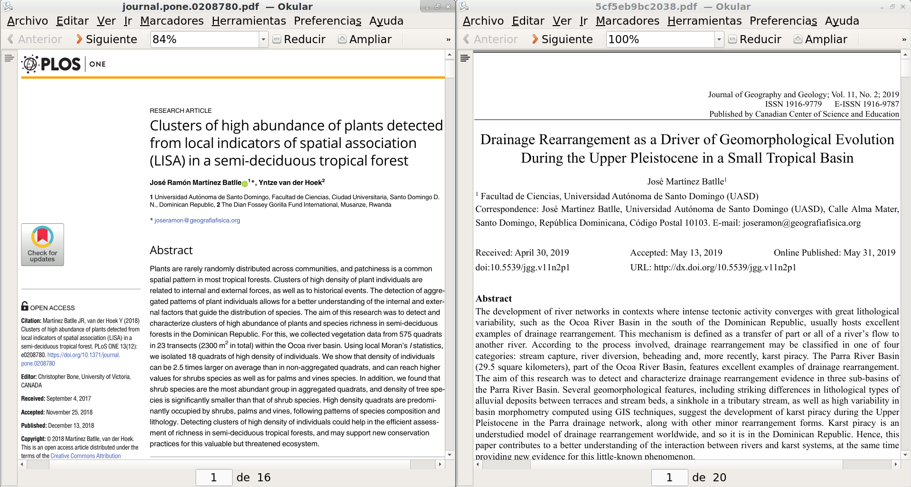

```{r setup, include=FALSE}
knitr::opts_chunk$set(echo = FALSE)
```


## Producción del último año


|   |   |
|---|---|
|<span style="font-size:60%;">[Clusters of high abundance of plants detected from local indicators of spatial association (LISA) in a semi-deciduous tropical forest](https://journals.plos.org/plosone/article?id=10.1371/journal.pone.0208780)</span> |<span style="font-size:60%;">[Drainage Rearrangement as a Driver of Geomorphological Evolution During the Upper Pleistocene in a Small Tropical Basin](http://www.ccsenet.org/journal/index.php/jgg/article/view/0/39703)|</span>|


## ¿Qué es RTK?

* Siglas de *real-time kinematic*, es una técnica de __navegación satelital global__, que utiliza la __fase de la onda portadora__ enviada por satélites de posicionamiento global, tales como GPS, GLONASS, Galileo y BeiDou, para calcular, con __precisión centimétrica__, la distancia entre una estación base de coordenadas conocidas y una estación exploradora o *rover*.

##


Tomado de @wiki2019accuracy


##

|
Tomado de @prieto2018precision

##


Tomado de @wiki2019accuracy

##

* La __precisión__ de la coordenada del *rover* respecto de la base es centimétrica.

* La __exactitud__ de la coordenada del *rover*, es decir, que tan cercano está el cálculo respecto de la posición verdadera, dependerá de la exactitud de la coordenada estación base. Si la coordenada de la __base es exacta__ ("veraz" visto como grupo coordenadas), también __lo será la del *rover*__.

##

* Mediante RTK, el posicionamiento por satélite de un punto $A$ se realiza mediante **trilateración**, un método que utiliza la __distancia entre éste y varios puntos conocidos__ (denominada también "rango", y realizada a través del "pseudorango"), siendo estos últimos los satélites.

* Dado que las coordenadas se generan para un espacio tridimensional, el proceso necesita de __al menos 4 satélites__.

* El algoritmo (esta palabra ya no es lo que era en RD, si es que alguna vez fue algo) empleado para obtener el resultado preciso se centra en la **resolución de la ambigüedad del número entero**, es decir, el número de ciclos completos que caben entre el receptor y el satélite. Cuando se conoce el número de ciclos, basta con multiplicarlo por la longitud de onda (19 cm) para obtener el pseudorango.

##

* El pseudorango no es una distancia precisa, porque está afectada por __fuentes de error de ámbito local/regional__ (retardo ionosférico y troposférico) __y global__ (sesgo de señal, de temporización y de órbita de los satélites).

* La estación base determina estas fuentes de error (puesto que conoce su posición precisa), y las transmite al *rover* en tiempo real (de ahí el *RT* de las siglas) en forma de correcciones para mejorar la posición.

##

* Para garantizar una coordenada precisa entre el *rover* y la estación base, __la distancia entre ellos no debe ser muy grande__ (se sugieren valores máximos de 10-30 km, pero en algunos casos esta exigencia no es practicable), puesto que se requiere que ambos compartan las mismas fuentes de error de ámbito regional.

* Las __fuentes de error globales__, aunque introducen sesgos importantes, no son usadas para establecer una distancia óptima entre el *rover* y la base.


# FUENTES

* La navegación cinética satelital (RTK-GNSS) es una técnica de posicionamiento global preciso que utiliza hardware y software de alto rendimiento. Hasta hace apenas 5 a 10 años, sólo un reducido número de fabricantes manufacturaba (y todavía manufactura) costosos equipos con firmware de código cerrado y bajo licencias privativas,  dirigidos principalmente al mercado profesional y corporativo. Con la publicación y actualización periódica de la biblioteca RTKLIB (primera versión, 2007), por Tomoji Takasu, se superó la principal limitación de software para generar soluciones RTK. Igualmente, la fabricación de procesadores pequeños y potentes, permitió llevar aplicaciones complejas a computadoras portátiles y de placa reducida. Además, la irrupción en el mercado de receptores GNSS de bajo coste impulsados por la industria automotriz, abarató significativamente la navegación RTK. En este estudio se presentan los resultados de soluciones fijas en modo estático generadas con RTKLIB en tiempo real y por posproceso utilizando como referencia la CORS de Santo Domingo, a partir de datos brutos colectados en el techo de un edificio de esta ciudad durante varios días en intervalos de 30 minutos, entre agosto y octubre de 2019. El equipo de colecta se compone de una Raspberry Pi, un receptor GNSS u-blox y dos antenas multi-constelación usadas en periodos separados. Tanto el software como el ensamblaje de hardware, fueron tomados del repositorio [*TouchRTKStation* de Taroz](https://github.com/taroz/TouchRTKStation). Los resultados muestran consistencia y precisión respecto de la estación de referencia, con error máximo del orden del centímetro. Se consideran potenciales aplicaciones para monitoreo de la deformación del terreno, así como para el estudio de fenómenos naturales como deslizamientos e inundaciones.

## RTKLIB

* Biblioteca [RTKLIB](http://www.rtklib.com/) (primera versión, 2007), por Tomoji Takasu [@takasu2011rtklib; @takasu2009development]


## RTKLIB


## TouchRTKStation

* [*TouchRTKStation* de Taroz](https://github.com/taroz/TouchRTKStation) [@taroz2019touchrtkstation]


<!--  -->

## rtkexplorer

* El website [rtkexplorer](http://rtkexplorer.com/) es un blog de iniciación en la tecnología RTK de bajo costo [@everett2019rtkexplorer]


## rtklibexplorer

* El blog [rtklibexplorer](https://rtklibexplorer.wordpress.com/) documenta proyectos RTK en profundidad [@everett2019rtklibexplorer]


# Referencias

## 
