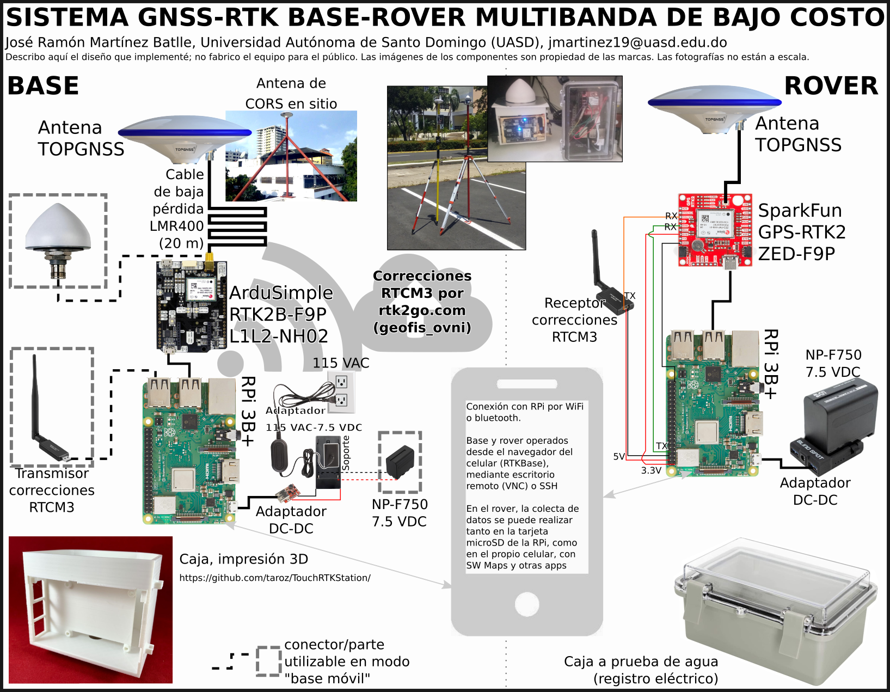
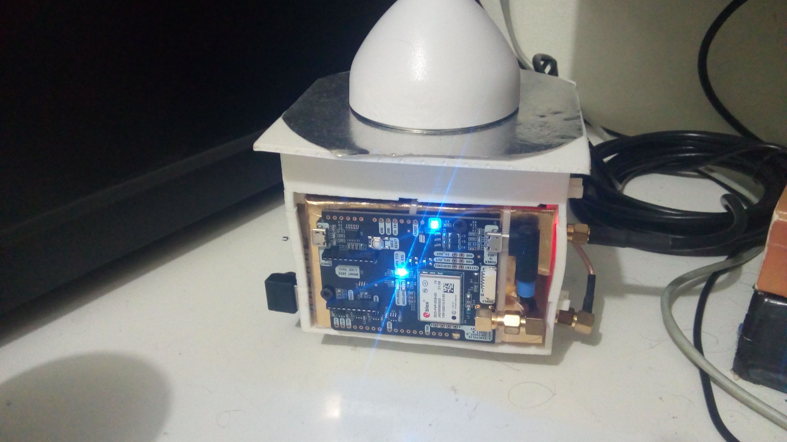
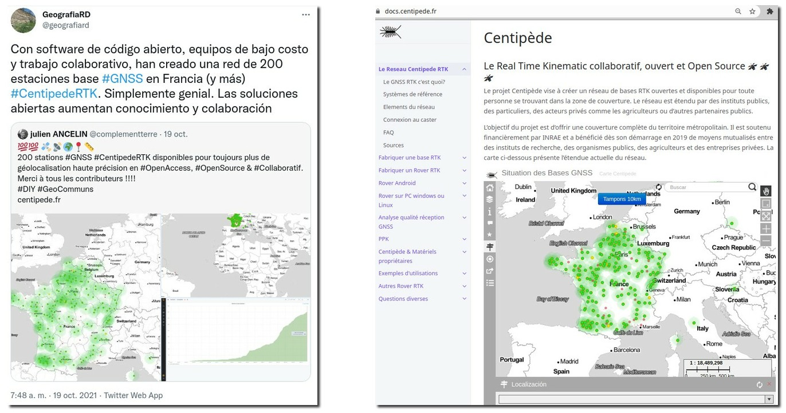
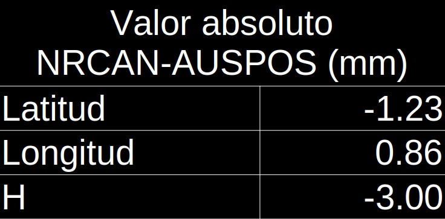
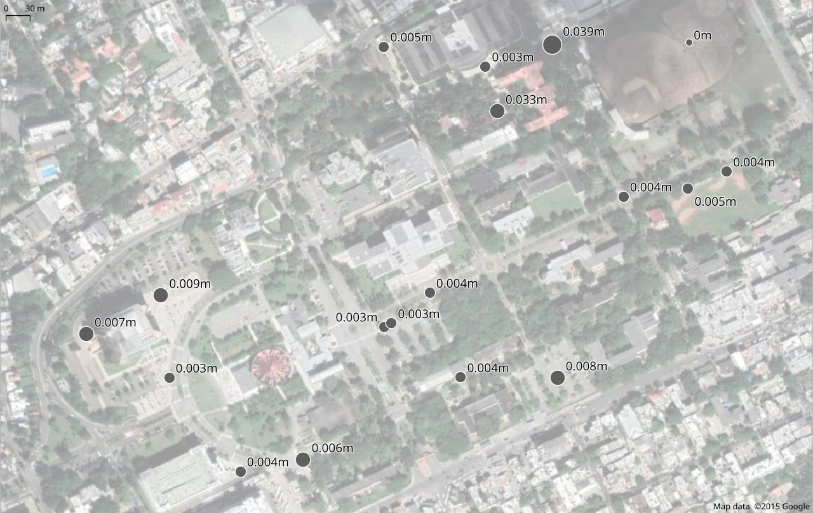
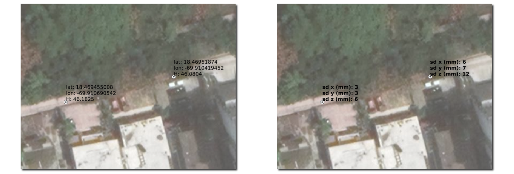

```{r setup, include=FALSE}
knitr::opts_chunk$set(echo = FALSE)
```

# INTRODUCCIÓN: ¿QUÉ ES RTK? APLICACIONES, LIMITACIONES

## Naturaleza

- Esta presentación muestra el desarrollo de un proyecto de __construcción/experimentación con tecnología GNSS-RTK__.

- Se trata de un proyecto autofinanciado, que constituye un __soporte esencial__ para otras múltiple investigaciones en marcha.

- Por lo tanto, su importancia radica en su capacidad de soportar __múltiples aplicaciones en geografía (entre otras áreas) a bajísimo costo y con soluciones libres, SIN SOFTWARE PRIVATIVO NI HARDWARE COSTOSO.__

## RTK

* Siglas de *real-time kinematic*, es una técnica de __navegación satelital global__, que utiliza la __fase de la onda portadora__ (a diferencia de la técnica convencional, basada en códigos pseudoaleatorios de baja frecuencia) enviada por satélites de posicionamiento, tales como GPS, GLONASS, Galileo y BeiDou, para calcular, con __precisión centimétrica__, la distancia entre una estación base de coordenadas conocidas y una estación exploradora o *rover*.

## Comparación entre técnica estándar y basada en onda portadora


|     |     |     |
|:---:|:---:|:---:|
|     | Basada en códigos pseudoaleatorios (estándar) | Posicionamiento preciso (basada en onda portadora) |
| Observaciones | Pseudorango (de códigos)| Onda portadora + pseudorango |
| Precio de receptor | Baratos, ~US\$100 | __Muy caros ~US\$10,000-40,000__ |
| Exactitud | 3 m (H), 5 m (V) | __5 mm (H) 1 cm (V) (modo estático)__ |
| Aplicaciones | Navegación marítima, búsqueda y rescate | Topografía, mensura, cartografía de alta precisión |
<small>Los costos son para equipos funcionales listos para usarse, "apenas sacados de su empaque"</small>

## Precisión, exactitud

|
<span style="font-size:60%;">Tomado de @prieto2018precision</span>

## Precisión y exactitud del *rover*

* La __precisión__ de la coordenada del *rover* respecto de la base es centimétrica.

* La __exactitud__ de la coordenada calculada en el *rover*, dependerá de la exactitud de la coordenada estación base. Si la coordenada de la __base es exacta__, también __lo será la del *rover*__.

<!-- ##  -->

## Trilateración

* El posicionamiento se realiza por medio de **trilateración**, un método que utiliza la __distancia entre el punto de interés y varios puntos conocidos__, siendo estos últimos los satélites.

* Dado que las coordenadas se generan para un espacio tridimensional, el proceso necesita de __al menos 4 satélites__.


<span style="font-size:60%;">Tomado de @gisgeography2019trilateration</span>


## Algoritmo

* El __algoritmo__ empleado para obtener un resultado preciso se centra en la **resolución de la ambigüedad del entero**, es decir, el número de ciclos completos que caben entre el receptor y el satélite. Existen __varias estrategias__ para ello, pero lo importante es que se consiga una __convergencia rápida de la solución__. Cuando se conoce el número de ciclos, basta con multiplicarlo por la longitud de onda (19 cm) para obtener el pseudorango.

* El __pseudorango es una distancia imprecisa__, porque está afectada por __fuentes de error de ámbito local/regional__ (retardo ionosférico y troposférico) __y otros__ (sesgo por geometría de constelación, por multitrayecto, por relojes del satélite y del receptor).

## Algoritmo

* La __estación base determina estas fuentes de error__ (puesto que conoce su propia posición), y las transmite al *rover* en tiempo real (de ahí el *RT* de las siglas) en forma de __correcciones__ para mejorar la posición.

* La estación base también puede __colectar datos brutos sin transmitirlos__ al *rover*. Dicha información se utiliza posteriormente para __realizar posproceso__ (PPK) de datos brutos almacenados en el *rover* para corregirlos.

## Algoritmo

* Para garantizar que el *rover* dé una coordenada una precisa, __la distancia entre éste y la estación base (*baseline*) no debe ser muy grande__, puesto que se requiere que ambos __compartan las mismas fuentes de error de ámbito regional__. Se sugieren valores máximos de 30-50 km en multibanda, aunque en algunos casos esta exigencia no puede satisfacerse.

* Las __fuentes de error globales__, aunque introducen sesgos importantes, no son usadas para establecer una distancia óptima entre el *rover* y la base.

<!-- ## Algoritmo -->

<!--  -->
<!-- <span style="font-size:60%;">Tomado de @kubo2018gnss</span> -->

## Fabricantes de receptores GNSS con capacidad RTK

- Trimble, Leica, Topcon, NovAtel, JAVAD, ...

- u-blox, Septentrio, Skytraq, ComNav Technology ...

## {width=85%}

## 

## Aplicaciones

* Monitoreo de __deslizamientos, fallas__.

* Mensura.

* Fotogrametría con __UAV__.

* Construcción, monitoreo de __edificaciones y estructuras__ (puentes)

* __Agricultura__ de precisión.

* Detección de __tsunamis__ por boyas GNSS.

* Sistemas de __transporte__, vehículos autónomos.

* Sistemas de cartografía __móviles__ (Street View).

## Limitaciones globales

- Alto __costo de equipos__ listos para usar.

- Red de CORS pública de __poca densidad__.

- __Redes privadas__ existentes y densas, aunque de __costos__ elevados.

- Predominio de __soluciones__ de software y hardware __cerradas__.

## ¿Por qué estoy "revisitando" este proyecto?

- En __2018__ construí una solución monobanda.

- Dicha solución, aunque útil para determinadas aplicaciones, fallaba en determinados ambientes para __converger eficientemente__ (AR).


## ¿Por qué estoy "revisitando" este proyecto?

- Desde entonces me concentré en:

    - Constuir una __solución integral__, que incluyera __base y rover ambos de doble frecuencia__.
    
    - Basándome en RTKLIB, crear el __scripts de operación básicos__, así como mejorar/adaptar software de terceros.

# MATERIALES Y MÉTODOS

## Hardware

## 

## 

## 

## 

## 

## <span style="font-size:60%;">Partes adquiridas para equipo de colecta (Financiamiento: "SALARIO-CyT")</span>

| Parte                                                                         | Costo aprox.|
|-------------------------------------------------------------------------------|------------:|
| Base o rover, los imprescindibles: receptor, RPi, antena.                     |    US$340   |
| Adaptador de corriente, palo, trípode, conectores, cables, carcasa, batería   |    US$240   |

<section style="font-size:60%;text-align: left;">

- No se incluyen fletes.

- Para una base fija tipo CORS, se deben añadir los costes del __soporte de hierro__ (~US$40) y __el cable__ (el valor dependerá del calibre elegido y la longitud del mismo). Otros complementos deseables son un __tribrach__ (base nivelante), __protección contra rayos__ y una estación meteorológica.
</section>

## ¿Qué es una Raspberry Pi?

{width=35%}
{width=35%}

## Software

## RTKLIB

* Biblioteca [RTKLIB](http://www.rtklib.com/) (primera versión, 2007), por Tomoji Takasu [@takasu2011rtklib; @takasu2009development]


## RTKLIB


## RTKLIB


## BashRTKStation


## RTKBase

## 

## RTKMisc


# RESULTADOS

## Solución PPP para la base (NRCAN)


## Solución PPP para la base (NRCAN)


## Comparación soluciones NRCAN y AUSPOS



## Animación de  GENERACIÓN DE FIX CON RTKBASE Y CON BASHRTKSTATION

## DEMOS: LETRAS UASD (ESTUDIANTES), PUNTOS EN UASD, DAP EN ÁRBOLES, LA PLAYA DE NAJAYO

## Campus UASD

## 

## 

## {width=70%}

## 

## 

## Playa Najayo


## Obras


## Mensura


## Hundimiento en César Nicolás Penson



## URL de rtk2go. SERVICIO PÚBLICO

# DISCUSIÓN Y PERSPECTIVAS

## Discusión

- Los resultados obtenidos __son precisos__, con errores estándar bastante bajos, de orden centimétrico incluso milimétrico.

- Las aplicaciones profesionales están demostradas.

- Su uso en la enseñanza es una de las aplicaciones idóneas

- Las aplicaciones para __monitoreo de movimiento de la estructura__ (por ejemplo,  por subsidencia), al menos para desplazamientos de desarrollo lento y de __orden centimétrico__, son perfectamente viables.

## Perspectivas. ¿Qué estoy haciendo actualmente con este equipo?

* Dando __capacitaciones__ básicas. Puertas abiertas a toda persona que dispuesta a trabajar en Linux, con software libre y en consola de comandos.

* Monitoreando de __deslizamientos__.

* Caracterizando __granulometría de carga gruesa__ superficial de lechos de río/llanura de inundación mediante UAV.

* Monitoreando __deformación en SD__, con énfasis en la UASD.

## Perspectivas


# REFERENCIAS

## 
