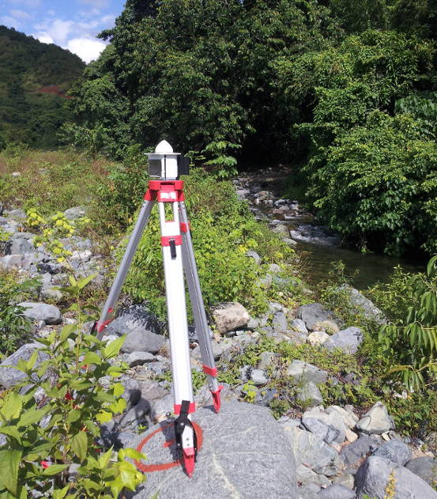
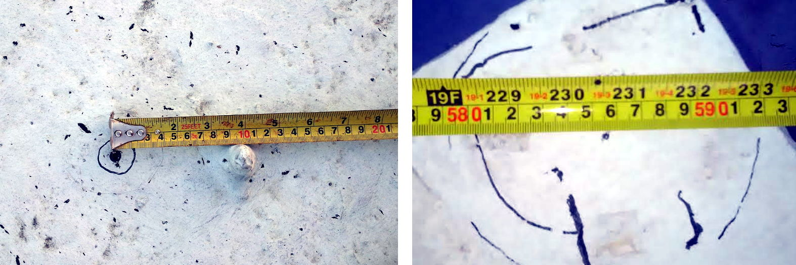

```{r setup, include=FALSE}
knitr::opts_chunk$set(echo = FALSE)
```

## Producción del último año


|   |   |
|---|---|
|<span style="font-size:60%;">[Clusters of high abundance of plants detected from local indicators of spatial association (LISA) in a semi-deciduous tropical forest](https://journals.plos.org/plosone/article?id=10.1371/journal.pone.0208780)</span> |<span style="font-size:60%;">[Drainage Rearrangement as a Driver of Geomorphological Evolution During the Upper Pleistocene in a Small Tropical Basin](http://www.ccsenet.org/journal/index.php/jgg/article/view/0/39703)|</span>|


# ¿QUÉ ES RTK?

##

* Siglas de *real-time kinematic*, es una técnica de __navegación satelital global__, que utiliza la __fase de la onda portadora__ (a diferencia de la técnica convencional, basada en códigos pseudoaleatorios de baja frecuencia) enviada por satélites de posicionamiento, tales como GPS, GLONASS, Galileo y BeiDou, para calcular, con __precisión centimétrica__, la distancia entre una estación base de coordenadas conocidas y una estación exploradora o *rover*.

## Comparación entre técnica estándar y basada en onda portadora

|     |     |     |
|:---:|:---:|:---:|
|     | Basada en códigos pseudoaleatorios (estándar) | Posicionamiento preciso (basada en onda portadora) |
| Observaciones | Pseudorango (de códigos)| Onda portadora + pseudorango |
| Precio de receptor | Baratos, ~US\$100 | __Muy caros ~US\$20,000-30,000__ |
| Exactitud | 3 m (H), 5 m (V) | __5 mm (H) 1 cm (V) (modo estático)__ |
| Aplicaciones | Navegación marítima, búsqueda y rescate | Mensura, cartografía de alta precisión |


## Precisión, exactitud y veracidad

|
<span style="font-size:60%;">Tomado de @prieto2018precision</span>

##


<span style="font-size:60%;">Tomado de @wiki2019accuracy</span>

## Precisión y exactitud del *rover*

* La __precisión__ de la coordenada del *rover* respecto de la base es centimétrica.

* La __exactitud__ de la coordenada calculada en el *rover* ("veracidad" si se refiere a grupo coordenadas), dependerá de la exactitud de la coordenada estación base. Si la coordenada de la __base es exacta__, también __lo será la del *rover*__.

## 

## Trilateración

* El posicionamiento se realiza por medio de **trilateración**, un método que utiliza la __distancia entre el punto de interés y varios puntos conocidos__, siendo estos últimos los satélites.

* Dado que las coordenadas se generan para un espacio tridimensional, el proceso necesita de __al menos 4 satélites__.


<span style="font-size:60%;">Tomado de @gisgeography2019trilateration</span>


## Algoritmo (no, ese no)

* El __algoritmo__ (sí, sí, esta palabra existía antes de los políticos) empleado para obtener el resultado preciso se centra en la **resolución de la ambigüedad del número entero**, es decir, el número de ciclos completos que caben entre el receptor y el satélite. Existen __varias estrategias__ para ello, pero lo importante es que se consiga una __convergencia rápida de la solución__. Cuando se conoce el número de ciclos, basta con multiplicarlo por la longitud de onda (19 cm) para obtener el pseudorango.

##

* El __pseudorango es una distancia imprecisa__, porque está afectada por __fuentes de error de ámbito local/regional__ (retardo ionosférico y troposférico) __y otros__ (sesgo por geometría de constelación, por multitrayecto, por relojes del satélite y del receptor).

* La __estación base determina estas fuentes de error__ (puesto que conoce su propia posición), y las transmite al *rover* en tiempo real (de ahí el *RT* de las siglas) en forma de __correcciones__ para mejorar la posición.

* La estación base también puede __colectar datos brutos sin transmitirlos__ al *rover*. Dicha información se utiliza posteriormente para __realizar posproceso__ (PPK) de datos brutos almacenados en el *rover* para corregirlos.

##

* Para garantizar que el *rover* dé una coordenada una precisa, __la distancia entre éste y la estación base (*baseline*) no debe ser muy grande__, puesto que se requiere que ambos __compartan las mismas fuentes de error de ámbito regional__. Se sugieren valores máximos de 10-30 km, aunque en algunos casos esta exigencia no puede satisfacerse.

* Las __fuentes de error globales__, aunque introducen sesgos importantes, no son usadas para establecer una distancia óptima entre el *rover* y la base.

##


<span style="font-size:60%;">Tomado de @kubo2018gnss</span>

## Fabricantes de receptores GNSS

* SiRF, u-blox, Garmin, Hemisphere, Trimble, Leica, Topcon, NovAtel, JAVAD, Magellan, ...


##


## Aplicaciones

* Mensura.

* Fotogrametría con UAV.

* Construcción, monitoreo de edificaciones y estructuras (puentes)

* Agricultura de precisión.

* Detección de tsunamis por boyas GNSS.

* Sistemas de transporte inteligentes, vehículos autónomos.

* Sistemas de cartografía móviles (Street View).

* Deportes.

# MATERIALES Y MÉTODOS

## RTKLIB

* Biblioteca [RTKLIB](http://www.rtklib.com/) (primera versión, 2007), por Tomoji Takasu [@takasu2011rtklib; @takasu2009development]


## RTKLIB


## RTKLIB


## TouchRTKStation

* [*TouchRTKStation* de Taroz](https://github.com/taroz/TouchRTKStation) [@taroz2019touchrtkstation]


## RTKLIB Touchscreen GUI


## rtkexplorer

* El website [rtkexplorer](http://rtkexplorer.com/) es un blog de iniciación en la tecnología RTK de bajo costo [@everett2019rtkexplorer]


## rtklibexplorer

* El blog [rtklibexplorer](https://rtklibexplorer.wordpress.com/) documenta proyectos RTK en profundidad [@everett2019rtklibexplorer]


## CORS RDSD


## Geomedición, Instrumentos y Sistemas


## Baseline


## <span style="font-size:60%;">Partes adquiridas para equipo de colecta (Financiamiento: "SALARIO-CyT")</span>

| Fecha       | Parte                                                             | Precio |
|-------------|-------------------------------------------------------------------|-------:|
| 7/jul/2019  | Raspberry Pi 3 B+                                                 |  US$38 |
| 8/jul/2019  | u-blox NEO-M8T                                                    |  US$75 |
| 16/jul/2019 | Pantalla táctil Waveshare 480x320                                 |  US$33 |
| 17/ago/2019 | Atenna TOPGNSS (sustituyó antena u-blox)                          |  US$53 |
| 18/ago/2019 | Impresión 3D de caja, [repo GitHub de Taroz](https://github.com/taroz/TouchRTKStation) |  US$37 |
| 17/ago/2019 | 2 Baterías 8800mAh NP-F970 (Sony) con cargador                    |  US$38 |
| 21/ago/2019 | Adaptador para batería, conversor a ~5V, cables                   |  US$28 |
| 13/sep/2019 | Trípode                                                           |  US$45 |
| 25/oct/2019 | Palo 2 m con nivel de burbuja                                     |  US$65 |
|             | __Total sin ensamblar__                                           | __US$161__ |
|             | __Total ensamblada__                                              | __US$302__ |
|             | __Total ensamblada con trípode__                                  | __US$347__ |
|             | __Total ensamblada con trípode y palo__                           | __US$412__ |

## ¿Qué es una Raspberry Pi?

* Es un ordenador [computador] de placa reducida, ordenador de placa única u __ordenador de placa simple (SBC) de bajo coste__ (~US$35 la 3 B+, tamaño tarjeta de crédito) desarrollado en el Reino Unido por la Raspberry Pi Foundation, con el objetivo de estimular la enseñanza de informática en las escuelas.

* El __software es de código abierto__, siendo su sistema operativo oficial una __versión adaptada de Debian, denominada Raspbian__, aunque permite usar otros sistemas operativos [@wiki2019raspberry].

##

* Se conocen múltiples aplicaciones, como PC de escritorio, *media center*, vídeo-vigilancia, domótica, configuración de VPN, servidor web, de archivos, de impresión, de juegos, sismógrafo, GNSS, entre otras.


##


##


##


##


##



##


##


## [rtk-r-wrappers](https://github.com/geofis/rtk-r-wrappers)


# RESULTADOS

## Muestras

* Se tomaron muestras con __cuatro configuraciones de equipamiento distintas__ en la medida que se adquiría nuevo equipamiento. Cada configuración corresponde a una posición distinta:

    * Sin ensamblar.
    * Unidad ensamblada.
    * Trípode + plomada.
    * Trípode + palo.

* Se tomaron __muestras cada dos o tres días__ las distintas configuraciones.

* Cada muestra se compone de colectas diarias de al menos __1500 épocas__ cada una.

##

* Se obtuvieron soluciones __fijas RTK__, pero se posprocesaron (__PPK__) los datos brutos usando la estación de referencia RDSD para mejorar la precisión.

* Se analizaron sólo las __soluciones fijas__. 

* Todo el proceso se realizó en __coordenadas ECEF__.

##

|Modo                                       |  Fechas     | N|              Foto                      |
|:------------------------------------------|:-----------:|-:|:-------------------------------------: |
|Sin ensamblar                              |1/ago-11/sep |36|        |
|Unidad ensamblada                          |12/sep-11/oct|23|               |
|Trípode + plomada                          |12/oct-23-oct| 6|        |
|Trípode + palo                             |31/oct-  -   |>5||


## Muestras en detalle. Soluciones fijas


##


##


##


##


## 


## Distancias planimétricas

```{r, echo = FALSE, warning=FALSE, message=FALSE}
require(sf)
require(tidyverse)
fixedsol_m_sf <- st_read('data/trabajo02_promedio_posiciones.gpkg', quiet=T)
names(fixedsol_m_sf)[3] <- 'geometry'
fixedsoldf <- fixedsol_m_sf %>%
  mutate(X=unlist(map(fixedsol_m_sf$geometry,1)), Y=unlist(map(fixedsol_m_sf$geometry,2))) %>%
  st_drop_geometry() %>% dplyr::select(mode, X,Y) %>% 
  as.data.frame()
fixedsoldf %>%
  as.data.frame() %>%
  remove_rownames %>%
  column_to_rownames('mode') %>% dist()
```


## Mediciones planimétricas con cinta métrica

```{r, echo=T}
#                  Disassembled   Assembled   Tripod + plummet
# Assembled
# Tripod + plummet
# Tripod + pole           5.854                          0.095
```


## Distribución de las observaciones


## Errores estándar por medio de *bootstrap*

```{r, echo = T}
# mode                  X      Y     Z
# Disassembled     0.0010 0.0011 0.002
# Assembled        0.0006 0.0009 0.006
# Tripod + plummet 0.0046 0.0054    NA
# Tripod + pole    0.0035 0.0051 0.011
```

## Desviaciones estándar


# DISCUSIÓN Y PERSPECTIVAS

## Discusión

* Los resultados obtenidos __son precisos__, con errores estándar bastante bajos, de orden centimétrico incluso milimétrico.

* Mediciones con __cinta métrica__ confirmaron la precisión de las posiciones.

* Se necesitan mediciones con __equipamiento alterno__ para evaluar exactitud, aunque los resultados preliminares son prometedores.

* Las aplicaciones para __monitoreo de movimiento de la estructura__ (por ejemplo,  por subsidencia), al menos para desplazamientos de desarrollo lento y de __orden centimétrico__, son perfectamente viables.

## DInSAR 2016-2018


Verde: ~10-20 mm de subsidencia <br>
Rojo: ~10-30 mm de elevación

## Componente vertical CORS RDSD


Izquierda, GAM. Derecha: Descomposición serie temporal <br>
Subsidencia capturada en ambos análisis

## Perspectivas

* Realizar Precise point positioning (__PPP__).

* Configurar un segundo receptor para el __tandem *base*+*rover*__, con TX/RX de correcciones por radiofrecuencia

* Monitorear de __deslizamientos__.

* Modelizar __granulometría de carga gruesa__ superficial mediante UAV.

* Monitorear __subsidencia__ urbana.

* Armar unidad __multibanda__.

# REFERENCIAS

## 
