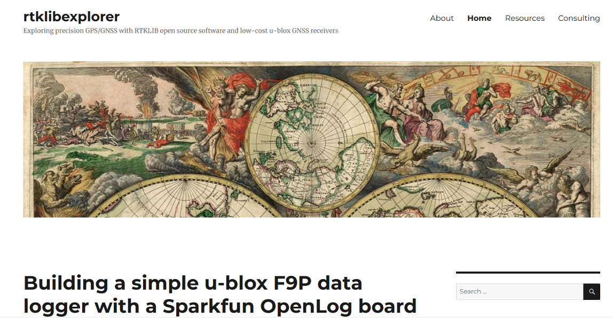

```{r setup, include=FALSE}
knitr::opts_chunk$set(echo = FALSE)
```


## Producción del último año


|   |   |
|---|---|
|<span style="font-size:60%;">[Clusters of high abundance of plants detected from local indicators of spatial association (LISA) in a semi-deciduous tropical forest](https://journals.plos.org/plosone/article?id=10.1371/journal.pone.0208780)</span> |<span style="font-size:60%;">[Drainage Rearrangement as a Driver of Geomorphological Evolution During the Upper Pleistocene in a Small Tropical Basin](http://www.ccsenet.org/journal/index.php/jgg/article/view/0/39703)|</span>|


# ¿Qué es RTK?

##

* Siglas de *real-time kinematic*, es una técnica de __navegación satelital global__, que utiliza la __fase de la onda portadora__ (a diferencia de la técnica convencional, basada códigos pseudoaleatorios de baja frecuencia) enviada por satélites de posicionamiento global, tales como GPS, GLONASS, Galileo y BeiDou, para calcular, con __precisión centimétrica__, la distancia entre una estación base de coordenadas conocidas y una estación exploradora o *rover*.

## Comparación entre técnica estándar y basada en onda portadora

|     |     |     |
|:---:|:---:|:---:|
|     | Basada en códigos pseudoaleatorios (estándar) | Posicionamiento preciso (basada en onda portadora) |
| Observaciones | Pseudorango (de códigos)| Onda portadora + pseudorango |
| Precio de receptor | Baratos, ~US\$100 | __Muy caros ~US\$20,000-30,000__ |
| Exactitud | 3 m (H), 5 m (V) | __5 mm (H) 1 cm (V) (modo estático)__ |
| Aplicaciones | Navegación marítima, búsqueda y rescate | Mensura, cartografía de alta precisión |


## Precisión, exactitud y veracidad

|
<span style="font-size:60%;">Tomado de @prieto2018precision</span>

##


<span style="font-size:60%;">Tomado de @wiki2019accuracy</span>

## Precisión y exactitud del *rover*

* La __precisión__ de la coordenada del *rover* respecto de la base es centimétrica.

* La __exactitud__ de la coordenada calculada en el *rover* ("veracidad" si se refiere a grupo coordenadas), dependerá de la exactitud de la coordenada estación base. Si la coordenada de la __base es exacta__, también __lo será la del *rover*__.

## Trilateración

* El posicionamiento se realiza por medio de **trilateración**, un método que utiliza la __distancia entre éste y varios puntos conocidos__, siendo estos últimos los satélites.

* Dado que las coordenadas se generan para un espacio tridimensional, el proceso necesita de __al menos 4 satélites__.


<span style="font-size:60%;">Tomado de @gisgeography2019trilateration</span>


## Algoritmo (no, ese no)

* El __algoritmo__ (sí, sí, esta palabra existía antes de los políticos) empleado para obtener el resultado preciso se centra en la **resolución de la ambigüedad del número entero**, es decir, el número de ciclos completos que caben entre el receptor y el satélite. Existen __varias estrategias__ para ello, pero lo importante es que se consiga una __convergencia rápida de la solución__. Cuando se conoce el número de ciclos, basta con multiplicarlo por la longitud de onda (19 cm) para obtener el pseudorango.

##

* El __pseudorango es una distancia imprecisa__, porque está afectada por __fuentes de error de ámbito local/regional__ (retardo ionosférico y troposférico) __y otros__ (sesgo por geometría de constelación, por multitrayecto, por relojes del satélite y del receptor).

* La __estación base determina estas fuentes de error__ (puesto que conoce su propia posición), y las transmite al *rover* en tiempo real (de ahí el *RT* de las siglas) en forma de __correcciones__ para mejorar la posición.

* La estación base también puede __colectar datos brutos sin transmitirlos__ al *rover*. Dicha información se utiliza posteriormente para __realizar posproceso__ (PPK) y corregir así las coordenadas colectadas por el rover.

##

* Para garantizar una coordenada precisa entre el *rover* y la estación base, __la distancia entre ellos no debe ser muy grande__ (se sugieren valores máximos de 10-30 km, pero en algunos casos esta exigencia no puede satisfacerse), puesto que se requiere que ambos __compartan las mismas fuentes de error de ámbito regional__.

* Las __fuentes de error globales__, aunque introducen sesgos importantes, no son usadas para establecer una distancia óptima entre el *rover* y la base.

##


<span style="font-size:60%;">Tomado de @kubo2018gnss</span>

# FABRICANTES DE RECEPTORES GNSS

##

* SiRF, u-blox, Garmin, Hemisphere, Trimble, Leica, Topcon, NovAtel, JAVAD, Magellan, ...


##


# APLICACIONES

##

* Mensura.

* Fotogrametría con UAV.

* Construcción, monitoreo de edificaciones y estructuras (puentes)

* Agricultura de precisión.

* Detección de tsunamis por boyas GNSS.

* Sistemas de transporte inteligentes, vehículos autónomos.

* Sistemas de cartografía móviles (Street View).

* Deportes.

# SOFTWARE DE CÓDIGO ABIERTO Y RECURSOS

<!-- * La navegación cinética satelital (RTK-GNSS) es una técnica de posicionamiento global preciso que utiliza hardware y software de alto rendimiento. Hasta hace apenas 5 a 10 años, sólo un reducido número de fabricantes manufacturaba (y todavía manufactura) costosos equipos con firmware de código cerrado y bajo licencias privativas,  dirigidos principalmente al mercado profesional y corporativo. Con la publicación y actualización periódica de la biblioteca RTKLIB (primera versión, 2007), por Tomoji Takasu, se superó la principal limitación de software para generar soluciones RTK. Igualmente, la fabricación de procesadores pequeños y potentes, permitió llevar aplicaciones complejas a computadoras portátiles y de placa reducida. Además, la irrupción en el mercado de receptores GNSS de bajo coste impulsados por la industria automotriz, abarató significativamente la navegación RTK. En este estudio se presentan los resultados de soluciones fijas en modo estático generadas con RTKLIB en tiempo real y por posproceso utilizando como referencia la CORS de Santo Domingo, a partir de datos brutos colectados en el techo de un edificio de esta ciudad durante varios días en intervalos de 30 minutos, entre agosto y octubre de 2019. El equipo de colecta se compone de una Raspberry Pi, un receptor GNSS u-blox y dos antenas multi-constelación usadas en periodos separados. Tanto el software como el ensamblaje de hardware, fueron tomados del repositorio [*TouchRTKStation* de Taroz](https://github.com/taroz/TouchRTKStation). Los resultados muestran consistencia y precisión respecto de la estación de referencia, con error máximo del orden del centímetro. Se consideran potenciales aplicaciones para monitoreo de la deformación del terreno, así como para el estudio de fenómenos naturales como deslizamientos e inundaciones. -->

## RTKLIB

* Biblioteca [RTKLIB](http://www.rtklib.com/) (primera versión, 2007), por Tomoji Takasu [@takasu2011rtklib; @takasu2009development]


## RTKLIB


## RTKLIB


## TouchRTKStation

* [*TouchRTKStation* de Taroz](https://github.com/taroz/TouchRTKStation) [@taroz2019touchrtkstation]


## RTKLIB Touchscreen GUI


## rtkexplorer

* El website [rtkexplorer](http://rtkexplorer.com/) es un blog de iniciación en la tecnología RTK de bajo costo [@everett2019rtkexplorer]


## rtklibexplorer

* El blog [rtklibexplorer](https://rtklibexplorer.wordpress.com/) documenta proyectos RTK en profundidad [@everett2019rtklibexplorer]



# EQUIPO DE COLECTA ENSAMBLADO

## 

| Parte | Precio |
|:--:|:--:|
| Raspberry Pi 3 B+ | |


##


##


##


##


# RESULTADOS


##


# CONCLUSIONES Y PERSPECTIVAS

## Conclusiones


## Perspectivas

* Precise point positioning (__PPP__).

* Configuración de segundo receptor para el __tandem *base*+*rover*__, con TX/RX de correcciones por radiofrecuencia

* Monitoreo de __deslizamientos__.

* Modelización de la __granulometría de carga gruesa__ superficial mediante UAV.

* Monitoreo de __subsidencia__.

# REFERENCIAS

## 
